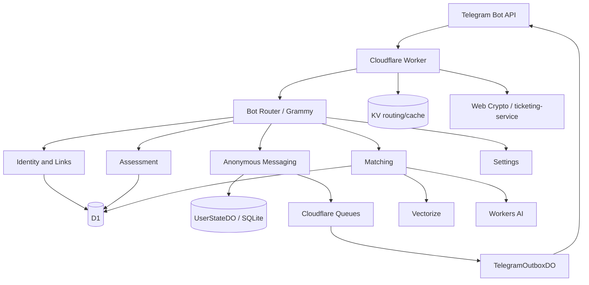

# Nekonymous

**Nekonymous** / **نِکونیموس** is a Persian-first anonymous Telegram bot for personal deep-link messaging, conversation-style assessment, and opt-in anonymous matching, built on a Cloudflare-native stack.

The project began as a small anonymous messaging bot and grew into a careful experiment in safer anonymous conversations: private inbox workflows, assessment-based conversation signals, and opt-in matching — without turning anonymity into marketing claims.

- **Project home:** [nekonymous.mohetios.dev](https://nekonymous.mohetios.dev)
- **Source:** [github.com/mohetios/Nekonymous](https://github.com/mohetios/Nekonymous)

---

## Status

| | |
|---|---|
| **Version** | `0.1.0` (V1 public release candidate) |
| **Runtime** | Single Cloudflare Worker |
| **Bot surface** | Telegram webhook only (`POST /bot`) |
| **Languages** | Persian-first UI; `fa` / `en` locale in data layer for assessment and matching |
| **Main storage** | D1 + Durable Objects (SQLite) + KV (routing/cache) |
| **Matching** | Opt-in only; discoverability off by default |
| **Security model** | Hosted anonymous relay; encrypted at rest; **not** E2EE |
| **Payments** | Not implemented in V1 |

There is no public website or SPA inside the Worker in V1. The bot is the product surface.

---

## What Nekonymous does

- **Personal anonymous link** — Each user gets a `t.me/{bot}?start={slug}` deep link to share.
- **Anonymous messages** — Visitors open the link and send text or supported media without exposing the owner’s Telegram username.
- **Inbox** — Owners receive an exact unread count and `/inbox` sends all unread messages.
- **Anonymous reply** — Replies stay anonymous in both directions through the same relay.
- **Block / report** — Per-sender block and structured report flow.
- **Pause / resume** — Temporarily stop incoming messages without deleting the account.
- **Private nickname** — Optional per-sender label visible only to the recipient.
- **Conversation-style assessment (ارزیابی)** — 56 Likert questions across 14 conversation-style dimensions (version `v1`).
- **Opt-in matching** — Users who complete the assessment can enable discoverability and search for conversation candidates.
- **Match requests** — A request is created only when the searcher sends an intro; the candidate must accept before messaging starts.
- **Hard account reset** — Full wipe of user-linked data and a brand-new internal id + public link.
- **Bilingual data support** — User records store `fa` or `en` locale for matching filters and profile embeddings; bot copy is Persian-first.

---

## What Nekonymous is not

Nekonymous is **not**:

- an end-to-end encrypted messenger
- a zero-knowledge system
- a perfect anonymity system
- a dating app
- a clinical or personality diagnosis tool
- a full social network
- a payment or subscription product in V1

Telegram sees plaintext while messages travel through Telegram. The Worker sees plaintext while processing delivery. Stored message payloads and chat identifiers are encrypted at rest where implemented, but that is not the same as E2EE.

---

## User flow

1. User runs `/start` (or opens the bot from the menu).
2. The bot creates or shows a personal anonymous link.
3. Another person opens the link and composes a message inside the bot.
4. The owner receives a notification and reads the message from `/inbox`.
5. The owner can reply anonymously, block, report, set a private nickname, or pause incoming messages from settings.
6. The user can start the conversation-style assessment from `/assessment` or the match hub.
7. After completing the assessment, the user can opt into discoverability for matching.
8. `/match` (or the match hub) shows the nearest current candidate options from deterministic ranking.
9. A match request is created only when the user sends an intro message.
10. A conversation starts only after the candidate accepts; acceptance creates a normal anonymous inbox ticket.

### Bot commands

```text
/start
/inbox
/settings
/assessment
/match
/match_system
```

### Main reply keyboard

```text
🔗 لینک من

🧭 پیشنهاد گفت‌وگو
⚙️ تنظیمات
```

---

## Architecture

Nekonymous runs as **one Cloudflare Worker** entry (`src/index.ts`) with a Telegram webhook and queue consumers for non-critical outbound delivery and event-driven stats aggregation.



| Layer | Technology | Role |
|--------|------------|------|
| Entry | Cloudflare Worker | `POST /bot` webhook; `neko-outbox` + `neko-stats` queue consumers |
| Bot framework | Grammy | Commands, messages, inline callbacks |
| Relational data | D1 (`nekonymous_core`) | Users, links, assessment, matching, anonymous stats |
| Per-user hot state | `UserStateDurableObject` (SQLite) | Inbox pointers, drafts, blocks, labels, rate limits, assessment session |
| Sealed tickets | `TicketVaultDurableObject` (SQLite) | Encrypted anonymous route and payload capsules |
| Blind reports | `ReportLedgerDurableObject` (SQLite) | Blinded abuse report tags |
| Outbound delivery | Queue + `TelegramOutboxDurableObject` | Idempotent non-critical Telegram sends |
| Routing cache | KV (`NEKO_KV`) | `tg:{hash}` → user id; `link:{slug}` → user id |
| Semantic discovery | Workers AI + Vectorize | Profile embeddings; candidate discovery only |
| Crypto | Web Crypto (`ticketing-service.ts`) | HMAC, HKDF-SHA-256, AES-256-GCM |

Design constraints for V1:

- KV is cache only — never the authority for inbox, profiles, or matching state.
- Vectorize narrows candidates; final ranking is deterministic TypeScript.
- Message payloads are cleared from the ticket vault after first successful inbox rendering; encrypted route capsules remain for reply/block/report/nickname until expiry.
- Account reset hard-deletes user-linked D1 rows; anonymous aggregate counters may remain.

See also [docs/onboarding.md](./docs/onboarding.md), [docs/architecture/matching-v1.md](./docs/architecture/matching-v1.md), [docs/architecture/messaging.md](./docs/architecture/messaging.md), and [AGENTS.md](./AGENTS.md) for maintainer-oriented detail.

---

## Storage model

### D1

Migrations live in `migrations/`; `0001_init.sql` is the squashed V1 base.

| Area | Tables |
|------|--------|
| **Identity** | `users`, `public_links` |
| **Assessment** | `assessment_profiles`, `assessment_attempts`, `assessment_answers`, `profile_vector_index_events` |
| **Matching** | `match_suggestions`, `match_requests`, `match_blocks`, `match_events` |
| **Anonymous stats** | `platform_stats` — single row, no user ids; survives account deletion |

D1 stores HMACed Telegram user hashes and encrypted Telegram chat ids, not raw Telegram ids. Assessment dimension scores and controlled summaries live in D1; raw anonymous message transcripts do not.

### Durable Objects / SQLite

**`UserStateDurableObject`** (one instance per internal user id):

| Table | Purpose |
|-------|---------|
| `user_state` | Pause flag, encrypted display name, locale mirror |
| `inbox_pointers` | Encrypted sealed-ticket references; cap 50 unread pointers |
| `drafts` | Compose / reply / settings draft state |
| `blocks` | Per-recipient block list |
| `contact_labels` | Private nicknames per sender |
| `rate_limits` | Global per-user action throttle (1-second gap) |
| `assessment_sessions` | In-progress assessment answers |
| `processed_events` | Webhook update idempotency (`processing` lease, `done` completion) |

**`TelegramOutboxDurableObject`** (one instance per chat hash):

| Table | Purpose |
|-------|---------|
| `sent_events` | Idempotent outbound send log |
| `rate_buckets` | Reserved for outbound rate shaping (schema only in V1) |

**`TicketVaultDurableObject`**:

| Table | Purpose |
|-------|---------|
| `tickets` | `ticket_hash`, owner proof, encrypted route/payload capsules, status, retention timestamps |

**`ReportLedgerDurableObject`**:

| Table | Purpose |
|-------|---------|
| `report_events` | Blinded sender/pair/link abuse tags and reporter proof |

### KV

KV (`NEKO_KV`) is **routing and cache only**:

| Key | Value |
|-----|--------|
| `tg:{telegram_user_hash}` | internal user id |
| `link:{slug}` | internal user id |

Do not use KV as source of truth for messages, profiles, assessment progress, or matching state. D1 and the user’s Durable Object are authoritative.

### Vectorize

Implemented for V1 matching discovery.

- **Index binding:** `PROFILE_VECTORS` → `nekonymous-profile-vectors`
- **Vector id:** `profile:{userId}:v1`
- **Embedding model:** `@cf/baai/bge-m3` (1024 dimensions)
- **Metadata:** hashed user id, locale (`fa`/`en`), discoverability, match eligibility, profile version — not raw answers, Telegram ids, or display names

Vector search returns candidates; deterministic code in `match-scoring.ts` and `match-selection.ts` makes the final ranking decision.

---

## Security model

Nekonymous is a **hosted anonymous relay**. It hides users from each other in normal product flows and avoids storing a plain anonymous message transcript in D1. Stored payloads and route metadata are encrypted at rest where implemented.

### What is protected in storage

| Mechanism | Implementation |
|-----------|----------------|
| Telegram user ids | HMAC-SHA-256 with `APP_HMAC_PEPPER` → `telegram_user_hash` in D1 |
| Telegram chat ids | AES-256-GCM encryption with `APP_MASTER_KEY` |
| Message payloads | Per-ticket HKDF-derived AES-256-GCM keys; envelope `{ v, kid, iv, ct }` |
| Callback tickets | Raw `ticketRef` values live only in Telegram buttons; storage uses hashes or encrypted references |
| Payload retention | `payload_enc` is cleared after first successful `/inbox` render; `route_enc` remains for actions until expiry |
| Webhook auth | `BOT_SECRET_KEY` as `X-Telegram-Bot-Api-Secret-Token` |

### Abuse controls and rate limits

Nekonymous uses layered limits: one global per-user throttle on every Telegram input, plus feature-specific quotas where abuse would be costly.

#### Global user-action throttle

All user-driven webhook updates go through Grammy middleware (`src/bot/user-rate-limit.ts`) before handlers run:

- **Scope:** every command (`/start`, `/inbox`, `/settings`, `/assessment`, `/match`, …), chat message, and inline callback (`o:`, `r:`, `t:`, `m:`, `ms:`, …)
- **Storage:** `UserStateDurableObject.rate_limits` (scope `user_action`)
- **Rule:** at most one consumed action per **1 second** per user (atomic `POST /consume-rate-limit` in the DO)
- **UX:** chat replies get `RATE_LIMIT_MESSAGE`; callbacks get a short `answerCallbackQuery` toast

The previous 5-second send/reply-only check was removed in favor of this single middleware path. One second is short enough for normal menu navigation and assessment taps, but caps scripted floods at roughly 60 actions/minute per user.

#### Feature-specific limits

| Limit | Where | Value | Purpose |
|-------|--------|-------|---------|
| Inbox unread cap | `UserStateDO.inbox_pointers` | 50 | Stop inbox flooding per recipient |
| Private nicknames | `UserStateDO.contact_labels` | 200 per user | Bound label storage |
| Display name length | settings / identity | 64 chars | Input sanitization |
| Nickname length | contact utils | 32 chars | Input sanitization |
| Match intro text | matching draft | 500 chars | Input sanitization |
| Match searches | D1 `match_events` | 50 / hour | Bound Vectorize + D1 search cost |
| Match requests created | D1 `match_events` | 300 / day | Bound outbound request spam |
| Pair cooldown | D1 `match_requests` | 30 days after accept/decline | Prevent repeat pings to same pair |
| Match dismiss block | D1 `match_blocks` | 30 days | Hide dismissed suggestions |
| Pending match list UI | matching constants | 20 shown | Bounded hub rendering |
| Match request TTL | D1 `match_requests` | 7 days | Expire stale pending requests |
| Assessment session | `UserStateDO.assessment_sessions` | 7-day TTL | Drop abandoned in-progress sessions |
| Outbox idempotency | `TelegramOutboxDO.sent_events` | per job key | Prevent duplicate Telegram sends |

#### Other safety controls

- Block before accept on new messages and replies
- Blind Abuse Ledger reports without D1 sender-recipient report rows
- Webhook secret validation (`BOT_SECRET_KEY`)

Matching search/request limits are enforced in `match-service.ts` via `match_events` counts. Inbox, blocks, drafts, and the global throttle are enforced in `UserStateDO`.

### Hard reset

Settings → **پاک کردن حساب** calls `clearUserAccountAndRecreate`:

1. Purge the user’s Durable Object (inbox, drafts, blocks, assessment session, …)
2. Hard-delete all D1 rows for that user (assessment, matches, links, …)
3. Delete Vectorize vector and KV routing keys
4. Create a new internal user id and public link

`platform_stats` lifetime counters are anonymous aggregates and are **not** decremented on delete.

### Security boundaries

**Nekonymous protects against:**

- casual database inspection of stored message payloads
- public exposure of raw Telegram user ids
- accidental long-term storage of message bodies after inbox delivery (where payload clearing is implemented)
- basic abuse via block, report, global action throttle, and feature quotas

**Nekonymous does not protect against:**

- Telegram seeing messages sent through Telegram
- the Worker runtime seeing plaintext during processing
- endpoint, secret, or platform compromise
- recipients screenshotting or forwarding messages
- legal or platform-level access to Telegram data
- perfect anonymity or identity guarantees

For vulnerability reporting, see [SECURITY.md](./SECURITY.md). For a maintainer-oriented threat model (D1 leak scenarios, D1 vs Vectorize roles), see [docs/security/threat-model.md](./docs/security/threat-model.md).

---

## Assessment model

The assessment is a **conversation-style product signal**, not a psychological, medical, or clinical diagnosis. User-facing copy uses **ارزیابی**, not “test” or “diagnosis.”

**V1 profile (`ASSESSMENT_VERSION = "v1"`):**

- **56** Likert-style questions (`1`–`5`)
- **14** dimensions, **4** questions each
- Active progress in `UserStateDO.assessment_sessions`
- Completed scores in D1 `assessment_profiles.dimension_scores_json`
- Controlled `profile_summary_text` for embeddings — raw answers are not shown to other users

**Dimensions** (labels from `src/features/assessment/question-bank.ts`):

| Key | Persian label |
|-----|----------------|
| `boundaryRespect` | مرزبانی و احترام |
| `honestyTransparency` | صداقت و شفافیت |
| `emotionalSensitivity` | حساسیت احساسی |
| `emotionalRegulation` | تنظیم هیجان |
| `socialEnergy` | انرژی اجتماعی |
| `warmthEmpathy` | گرمی و همدلی |
| `reliabilityConsistency` | ثبات و پیگیری |
| `curiosityDepth` | کنجکاوی و عمق |
| `depthPreference` | ترجیح گفت‌وگوی عمیق |
| `replyPacePreference` | ریتم پاسخ‌دهی |
| `directnessPreference` | شفافیت و مستقیم‌بودن |
| `conflictRepair` | ترمیم سوءتفاهم |
| `supportPreference` | نیاز به شنیده‌شدن |
| `anonymityComfort` | راحتی با ناشناس‌بودن |

Do not treat dimension scores as identity truth, compatibility proof, or mental-health assessment.

---

## Matching model

Matching is **opt-in**, **approximate**, and **not dating**. Copy prefers “nearest current options” over “perfect match” or shame framing.

### Pipeline (current V1)

```text
Completed v1 assessment + discoverability enabled + match-eligible profile
  → Vectorize topK=30 (metadata: profileVersion, discoverable, matchEligible, locale)
  → merge bounded discoverable D1 profiles when the index is sparse
  → hard filters (blocks, recent declines, eligibility, …)
  → deterministic ranking in TypeScript
  → top 5 suggestions shown
  → requester sends encrypted intro → match_request (pending)
  → candidate accept → normal anonymous inbox ticket
  → candidate decline → no ticket
```

**Rules:**

- Discoverability defaults to **off**.
- Vector search is candidate discovery, not the final decision.
- Final ranking uses frozen trait weights, floor/closeness/mixed fits, confidence and freshness signals, and hard rejections.
- Low scores are not shown as compatibility percentages.
- Matching does not promise exact compatibility or safety.

Pending match requests do not create inbox tickets until acceptance.

---

## Local development

### Prerequisites

- Node.js 22+
- [pnpm](https://pnpm.io/)
- Cloudflare account with Workers, D1, KV, Durable Objects, Queues, Workers AI, and Vectorize enabled
- Telegram bot token from [@BotFather](https://t.me/BotFather)

### Install

```bash
pnpm install
cp .env.example .dev.vars
```

Fill `.dev.vars` with real secrets. Never commit `.dev.vars`.

### Apply local D1 migrations

```bash
pnpm db:migrations:apply:local
```

### Run the Worker locally

```bash
pnpm dev
```

This runs `wrangler dev --local --port 8787`.

Telegram needs a public HTTPS URL for webhooks. For local testing, expose the local port with a tunnel (for example [cloudflared](https://developers.cloudflare.com/cloudflare-one/connections/connect-networks/)) and point `setWebhook` at `https://<tunnel-host>/bot` with the same `secret_token` as `BOT_SECRET_KEY`.

### Checks

```bash
pnpm typecheck
pnpm lint
pnpm knip
pnpm test
pnpm check    # typecheck + lint + knip + all verify scripts
```

| Script | What it runs |
|--------|----------------|
| `pnpm test:ticketing` | Crypto roundtrip: payload envelope, chat id seal, HMAC |
| `pnpm test:assessment` | Question bank validation and scoring invariants |
| `pnpm test:matching` | Deterministic ranking smoke tests |
| `pnpm audit:d1` | Read-only remote D1 privacy audit |
| `pnpm audit:d1:local` | Same audit against local D1 |

---

## D1 privacy audit

Repeatable read-only check that D1 has no plaintext message bodies, raw Telegram ids, or other data that violates the V1 storage model:

```bash
pnpm audit:d1          # production D1 + KV + Vectorize summary
pnpm audit:d1:local    # local wrangler dev D1
```

SQL reference: `tools/audit-d1.sql`. The script exits non-zero if privacy checks fail.

---

## Environment variables and Cloudflare bindings

Local secrets live in `.dev.vars` (from `.env.example`). Production secrets use `wrangler secret put`.

### Secrets and vars

| Name | Type | Required | Used for |
|------|------|:--------:|----------|
| `SECRET_TELEGRAM_API_TOKEN` | secret | yes | Telegram Bot API |
| `BOT_SECRET_KEY` | secret | yes | Webhook `X-Telegram-Bot-Api-Secret-Token` validation |
| `APP_MASTER_KEY` | secret | yes | Payload, chat id, nickname encryption (≥ 32 bytes entropy) |
| `APP_HMAC_PEPPER` | secret | yes | HMAC for `telegram_user_hash` (≥ 32 bytes entropy) |
| `BOT_INFO` | var | yes | Cached JSON from Telegram `getMe` (`result` object only) |
| `BOT_NAME` | var | yes | Display name in bot copy |
| `BOT_USERNAME` | var | yes | Bot username without `@` for `t.me` links |
| `PRODUCTION_WEBHOOK_URL` | reference | no | Documented in `.env.example`; not read by Worker runtime |

### Wrangler bindings (`wrangler.jsonc`)

| Binding | Resource | Required | Used for |
|---------|----------|:--------:|----------|
| `DB` | D1 `nekonymous_core` | yes | Users, assessment, matching, stats |
| `NEKO_KV` | KV namespace | yes | `tg:` / `link:` routing cache |
| `USER_STATE_DO` | Durable Object | yes | Per-user inbox, drafts, blocks, assessment session |
| `TELEGRAM_OUTBOX_DO` | Durable Object | yes | Idempotent outbound Telegram sends |
| `TICKET_VAULT` | Durable Object | yes | Sealed Ticket Routing vault |
| `REPORT_LEDGER` | Durable Object | yes | Blind Abuse Ledger |
| `NEKO_OUTBOX_QUEUE` | Queue `neko-outbox` | yes | Async recipient notifications |
| `NEKO_STATS_QUEUE` | Queue `neko-stats` | yes | Event-driven stats aggregation |
| `AI` | Workers AI | yes | Profile embedding generation |
| `PROFILE_VECTORS` | Vectorize `nekonymous-profile-vectors` | yes | Match candidate discovery |

Copy `wrangler.jsonc.example` to `wrangler.jsonc` and replace placeholder binding IDs for a fresh Cloudflare account.

### Production secrets

```bash
wrangler secret put SECRET_TELEGRAM_API_TOKEN
wrangler secret put BOT_SECRET_KEY
wrangler secret put APP_MASTER_KEY
wrangler secret put APP_HMAC_PEPPER
wrangler secret put BOT_INFO
wrangler secret put BOT_NAME
wrangler secret put BOT_USERNAME
```

---

## Database and migrations

D1 database name: **`nekonymous_core`**, binding: **`DB`**, migrations directory: **`migrations/`**.

| File | Purpose |
|------|---------|
| `0001_init.sql` | Full squashed V1 schema: users, links, assessment, matching, `platform_stats` |

```bash
# Local (wrangler dev --local)
pnpm db:migrations:apply:local

# Remote / production
pnpm db:migrations:apply:remote
```

`pnpm deploy` applies remote migrations then runs `wrangler deploy --minify`.

**Warning:** Remote migrations affect production data. Review SQL before applying. `./tools/flush-remote.sh` is destructive: it deploys pending Durable Object reset migrations, drops/recreates D1 from the squashed migration, deletes KV routing keys, and recreates the Vectorize index. Future Durable Object wipes require bumping the DO class generation in `wrangler.jsonc`.

---

## Telegram setup

1. Create a bot with [@BotFather](https://t.me/BotFather) and save the token.
2. Put the token in `.dev.vars` as `SECRET_TELEGRAM_API_TOKEN` (local) or `wrangler secret put` (production).
3. Fetch bot info and set `BOT_INFO`, `BOT_NAME`, and `BOT_USERNAME`.
4. Generate a random `BOT_SECRET_KEY` for webhook validation.
5. Run local dev (`pnpm dev`) with a tunnel, or deploy to Cloudflare.
6. Register the webhook:

```bash
curl -X POST "https://api.telegram.org/bot<TOKEN>/setWebhook" \
  -H "Content-Type: application/json" \
  -d '{
    "url": "https://nekonymous.mohetios.dev/bot",
    "secret_token": "<BOT_SECRET_KEY>",
    "allowed_updates": ["message", "callback_query"]
  }'
```

Replace the URL with your Worker route or tunnel URL.

7. Send `/start` to the bot and confirm the personal link appears.

---

## Deployment

### One-time Cloudflare setup

1. `wrangler login`
2. Create or bind resources referenced in `wrangler.jsonc` (or start from `wrangler.jsonc.example`):
   - D1 database `nekonymous_core`
   - KV namespace `NEKO_KV`
   - Queues `neko-outbox`, `neko-stats`, and dead-letter queue `neko-dlq`
   - Durable Object classes configured in `wrangler.jsonc` (`UserStateDurableObjectV2`, `TelegramOutboxDurableObjectV2`, `TicketVaultDurableObjectV2`, `ReportLedgerDurableObjectV2`)
   - Vectorize index `nekonymous-profile-vectors`
   - Workers AI binding
3. Set all secrets (see above).
4. Apply migrations: `pnpm db:migrations:apply:remote`

### Deploy

```bash
pnpm deploy
```

GitHub Actions workflows exist under [`.github/workflows/`](./.github/workflows/) but are **disabled by default** (`workflow_dispatch` only). Deploy manually with `pnpm deploy`.

### Post-deploy verification

- `setWebhook` points to `https://<your-domain>/bot` with `secret_token`
- `/start` — link created
- `/inbox` — all unread messages render once, then the empty state is shown on the next open
- `/assessment` — flow starts
- `/match` — hub loads after completed assessment
- Settings → account reset — hard delete and new link

---

## Testing and release checks

### Automated

```bash
pnpm check
```

Runs `typecheck`, `lint`, `knip`, `test:ticketing`, `test:assessment`, and `test:matching`.

### V1 release checklist

- [ ] `LICENSE`, `SECURITY.md`, and `CONTRIBUTING.md` in place
- [ ] README updated
- [ ] `.env.example` checked against `Environment` in `src/types.ts`
- [ ] Security model documented; no E2EE or zero-knowledge claims
- [ ] Persian-first copy reviewed (`src/i18n/messages.ts`, feature copy files)
- [ ] No payment-implemented claims
- [ ] Migrations verified locally and on staging/production
- [ ] Deploy flow verified (`pnpm deploy`)
- [ ] `/start` verified
- [ ] `/inbox` verified
- [ ] `/assessment` verified
- [ ] `/match` verified
- [ ] Hard account reset verified
- [ ] Webhook `secret_token` enforced

---

## Folder structure

```txt
src/
  index.ts                 # Worker entry, DO exports, queue consumer
  types.ts
  bot/                     # Grammy wiring, menus, keyboards, webhook router
  features/
    identity/              # users, links, KV cache, hard delete
    messaging/             # relay, inbox, reply, block, report
    settings/
    assessment/            # v1 questionnaire, profile, vectors
    matching/
    platform/              # anonymous platform_stats
  storage/                 # UserState + TelegramOutbox DOs and clients
  queues/
  ticketing/               # crypto, capabilities, ticket envelopes
  i18n/
  utils/

migrations/
tools/                     # verify-*, flush-remote.*
docs/
  architecture/matching-v1.md
  security/threat-model.md
.github/workflows/         # check.yml, deploy.yml (manual only)
LICENSE
SECURITY.md
CONTRIBUTING.md
```

There is no separate crypto package; cryptography lives in `src/ticketing/` (`ticketing-service.ts` plus flat helper modules).

---

## Roadmap

### V1 (current)

- Telegram-only anonymous deep-link messaging
- Encrypted inbox tickets in `UserStateDO`
- Assessment v1 (56 questions / 14 dimensions)
- Opt-in matching with accept-gated intros
- Block, report, pause, private nicknames
- Hard account reset with aggregate stat retention
- Persian-first bot UX

### Later (possible)

- Telegram Stars / paid credits
- Detailed profile report for the user
- AI-assisted intro rewrite
- Stronger abuse tooling and moderation
- Richer admin/ops tooling
- Better analytics
- Optional web docs or landing page outside the Worker

### Not in scope

- E2EE messenger
- Dating app positioning
- Full social network
- Clinical or personality diagnosis
- Public website / SPA inside the Worker for V1
- Payment or subscription implementation in V1

---

## Contributing

Contributions are welcome. See [CONTRIBUTING.md](./CONTRIBUTING.md) for principles, local checks, and security reporting. Maintainer-oriented Worker rules live in [AGENTS.md](./AGENTS.md).

---

## License

MIT License. See [LICENSE](./LICENSE).

---

## Maintainer

Built by **Ali Zemani** ([Mohetios](https://mohetios.dev)).
