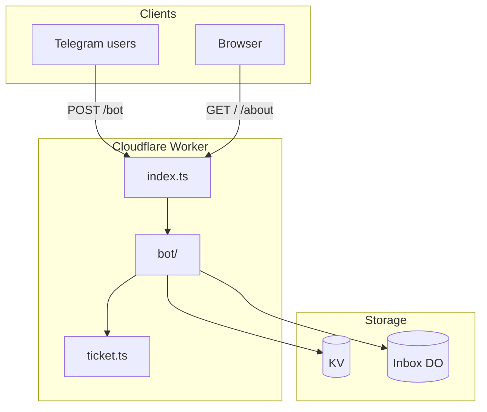

# Nekonymous

**Nekonymous** (نِکونیموس) is a Persian-first anonymous messaging bot for Telegram. Each user gets a personal link; anyone who opens it can send them a message without showing their name or username. Replies stay anonymous in both directions. The bot runs as a single [Cloudflare Worker](https://developers.cloudflare.com/workers/) with encrypted storage at the edge.

---

## Architecture

### What runs where

Everything lives in one Worker (`src/index.ts`). Telegram talks to the Worker over a signed webhook; users can also open lightweight HTML pages on the same domain.

| Layer | Technology | Role |
|-------|------------|------|
| HTTP edge | Cloudflare Worker | Routes, webhook, static HTML, ops cleanup |
| Bot runtime | [Grammy](https://grammy.dev/) | Telegram updates, commands, keyboards |
| User & metadata | Cloudflare **KV** | Profiles, UUID map, encrypted conversation blobs, stats |
| Inbox queue | **Durable Object** per recipient | Pending messages + callback refs for reply/block/nickname |
| Crypto | Web Crypto API | HKDF-SHA-256 key derivation, AES-256-GCM |



### HTTP surface

| Method | Path | Purpose |
|--------|------|---------|
| `GET` | `/` | Landing page and aggregate stats |
| `GET` | `/about` | About and privacy copy |
| `POST` | `/bot` | Telegram webhook (`BOT_SECRET_KEY` header) |
| `POST` | `/admin/cleanup` | Ops: purge all inbox DOs + wipe KV (`user`, `conversation`, `userUUIDtoId`, `stats`) — `Authorization: Bearer BOT_SECRET_KEY` |

### Storage layout

| KV key | Example | Contents |
|--------|---------|----------|
| `user:{telegramId}` | `user:123456` | Name, link UUID, block list, contact labels, draft conversation |
| `userUUIDtoId:{uuid}` | `userUUIDtoId:abc…` | Shareable link token → Telegram user ID |
| `conversation:{id}` | `conversation:xY…` | Encrypted JSON (connection + payload or metadata-only after read) |
| `stats:*` | `stats:newUser:2026-06-11`, `stats:total:newUser` | Daily counters + running totals for the home page |

| Durable Object | One per | Contents |
|----------------|---------|----------|
| `InboxSqliteDurableObject` | recipient Telegram ID | SQLite table `inbox_entries` (per-message rows; cap 50) |

**Anonymity:** Recipients do not see sender usernames in Telegram. The operator can map UUIDs to Telegram IDs and decrypt bodies with `APP_SECURE_KEY` — this is a hosted relay, not E2E encryption.

### Message ticket model

Each anonymous message uses a fresh random **ticket** (256-bit, base64url):

1. **Ticket** — capability handle; stored in the recipient's inbox DO.
2. **Conversation ID** — HKDF-derived KV key (domain-separated from the AES key).
3. **Ciphertext** — AES-256-GCM in KV and copied into the DO entry until delivery (`iv.ciphertext`, base64url).
4. **Ref** — 8 hex chars for Telegram inline buttons (`rpl:`, `blk:`, `ubl:`, `nnk:` prefixes, under the 64-byte callback limit).
5. **Sender alias** — HKDF-derived opaque key per recipient+sender pair; keys `contactLabels` on the recipient profile (nickname text only, never in ciphertext or DO).

### Data flows

#### Send message

1. Sender opens a `/start {uuid}` deep link (22-char base64url token).
2. Bot encrypts conversation JSON via `encryptConversationPayload` → saves to KV → enqueues in recipient's inbox DO (with ciphertext copy).
3. Sender gets confirmation; recipient gets an inbox count notification (`pendingCount` from DO `/add`).

#### Read inbox (`/inbox`)

1. Bot lists **pending** (undelivered) DO entries.
2. Decrypts from DO ciphertext, delivers to Telegram with reply/block/nickname keyboard (shows saved nickname in the message when set).
3. Notifies sender that the message was seen.
4. Clears payload in KV (keeps `connection` for reply/block), marks entry `delivered` in DO (drops ciphertext, keeps `ref`).

#### Reply / block / nickname

1. Recipient taps inline button (`rpl:{ref}`, `blk:{ref}`, `ubl:{ref}`, or `nnk:{ref}`).
2. Bot loads DO entry by `ref`, decrypts connection metadata from KV.
3. **Reply** sets a new draft conversation (prompt includes nickname when set).
4. **Block** / **unblock** updates `blockList` in KV.
5. **Nickname** prompts for a label, stores it in `contactLabels[senderAlias]` on the recipient's `user` record. Senders never see nicknames; labels are not stored in conversation ciphertext or the inbox DO.

Nicknames are per recipient and per anonymous sender. The same person can have different labels for different users. Up to 200 labels per account (32 characters each). Remove a label by sending `حذف`, `−`, or `-`.

### Code map

```
src/
├── index.ts              Worker entry, routes, DO export, deferred stats wiring
├── types.ts              User, Conversation, Environment
├── admin/cleanup.ts      Full KV + inbox purge endpoint
├── bot/
│   ├── bot.ts            Grammy wiring, bot instance cache
│   ├── commands.ts       /start, /inbox, outbound messages
│   ├── actions.ts        Inline reply / block / unblock / nickname
│   ├── settings.ts       /settings, display name, pause, account delete
│   └── inboxDU.ts        InboxSqliteDurableObject (SQLite inbox)
├── front/                Public HTML
└── utils/
    ├── ticket.ts         HKDF + AES-GCM, encryptConversationPayload
    ├── contact.ts        Nickname sanitize, lookup, save
    ├── inbox.ts          Inbox DO client + decrypt helpers
    ├── kv-storage.ts     KVModel wrapper
    ├── user.ts           ensureUser, deep links, display-name guards
    ├── payload.ts        Conversation JSON parse
    ├── worker.ts         scheduleWork / waitUntil for stats
    ├── logs.ts           Daily + running homepage stats
    ├── sender.ts         Deliver decrypted media to Telegram
    ├── telegram-limits.ts  Callback size, text/caption truncation
    ├── messages.ts       Persian bot copy
    ├── messages-settings.ts  Settings menu copy
    ├── constant.ts       Keyboards, reserved display-name checks
    └── tools.ts          Rate limit, HTML helpers, Persian digits

tools/
├── cleanup.mjs           Ops CLI → POST /admin/cleanup
└── verify-crypto.ts      Crypto smoke tests (pnpm test:crypto)
```

### Operational limits

- **Webhook auth** — `BOT_SECRET_KEY` must match Telegram `secret_token`.
- **Rate limit** — 5 seconds between link opens and sends.
- **Inbox cap** — 50 pending messages per recipient DO.
- **Callbacks** — Only `connection.to` may reply, block, or set a nickname using a ticket ref.
- **Contact labels** — Up to 200 nicknames per user; opaque alias keys (HKDF), plain label text on the recipient profile only.
- **Display names** — Menu button labels (e.g. plain «تنظیمات») cannot be saved as a public name; senders see a safe fallback («کاربر») when the owner has no valid name.
- **Pause inbox** — Recipients can stop **new** link messages via settings; thread replies from an existing conversation still work.

---

## How It Works (user view)

1. **Get your link** — `/start` or **🔗 دریافت لینک** returns your personal `t.me/...?start=…` URL.
2. **Receive anonymously** — Others open your link and send; you read via `/inbox`.
3. **Reply, block, or label** — Use **پاسخ** / **بلاک** / **🏷️ نام مستعار** on each delivered message. Nicknames appear on future messages from that sender (e.g. `📩 از علی:`) and in the reply prompt; only you see them.
4. **Settings** — `/settings` or **⚙️ تنظیمات**: edit display name, pause/resume receiving, clear block list, or delete account and get a fresh link.
5. **Protection** — Rate limits, self-message blocking, and per-sender block lists.

---

## Getting Started

### Prerequisites

- **Node.js** 22+
- **pnpm** 9+
- **Cloudflare account** (Workers, KV, Durable Objects)
- **`wrangler.toml`** or **`wrangler.jsonc`** in the project root (gitignored locally; copy from `wrangler.jsonc.example`)

### Install

```bash
pnpm install
```

### Secrets

Copy `.env.example` to `.dev.vars` and fill in:

- `SECRET_TELEGRAM_API_TOKEN` — from @BotFather
- `BOT_SECRET_KEY` — random string for webhook validation
- `APP_SECURE_KEY` — long random string for message encryption
- `BOT_INFO` — JSON `result` from `getMe`
- `BOT_NAME` — shown on public pages

Set the same values as Wrangler secrets for production (`wrangler secret put …`).

### Wrangler / Durable Objects

Copy `wrangler.jsonc.example` to `wrangler.jsonc` (or merge into your `wrangler.toml`) and set your KV namespace id.

The inbox uses a **SQLite-backed** `InboxSqliteDurableObject`. New projects: `new_sqlite_classes` in migrations. Existing KV `InboxDurableObject` deployments need `deleted_classes` + `new_sqlite_classes` (see `wrangler.toml`).

### Local worker

```bash
pnpm dev
```

Runs Wrangler on port 8787. Telegram will not reach a local worker unless you point the bot webhook at a public URL yourself.

### Quality checks

```bash
pnpm check
```

Runs typecheck, lint, knip, and crypto roundtrip tests. CI runs this on every push and pull request.

### Deploy

```bash
pnpm deploy
```

Pushes to `master` also deploy via GitHub Actions (`CF_API_TOKEN`, `CF_ACCOUNT_ID`, `CF_ZONE_ID`).

### Ops cleanup (full reset)

```bash
WORKER_URL=https://your-worker.example.com BOT_SECRET_KEY=... pnpm cleanup
```

Calls `POST /admin/cleanup`: purges every inbox Durable Object for known users, then deletes all KV under `conversation:`, `user:`, `userUUIDtoId:`, and `stats:`. **Destructive** — users must `/start` again and share new links.

See [docs/migration-plan.md](docs/migration-plan.md) for optional storage evolution (stats totals, SQLite inbox — both shipped).

---

## Security Overview

- **Encryption at rest** — AES-256-GCM; per-ticket keys via HKDF-SHA-256 (`APP_SECURE_KEY` + ticket salt).
- **Webhook** — Requests must include `X-Telegram-Bot-Api-Secret-Token: BOT_SECRET_KEY`.
- **Ticket auth** — Reply/block callbacks resolve through the recipient's inbox DO; `connection.to` is verified server-side.
- **Payload lifecycle** — Message content is cleared from KV after inbox delivery; connection metadata remains for threading.
- **Contact labels** — Stored on the recipient's user record, keyed by HKDF sender alias (not raw Telegram IDs in the label map). Never sent to the sender or written into encrypted conversation blobs.

See [AGENTS.md](AGENTS.md) for contributor conventions.
