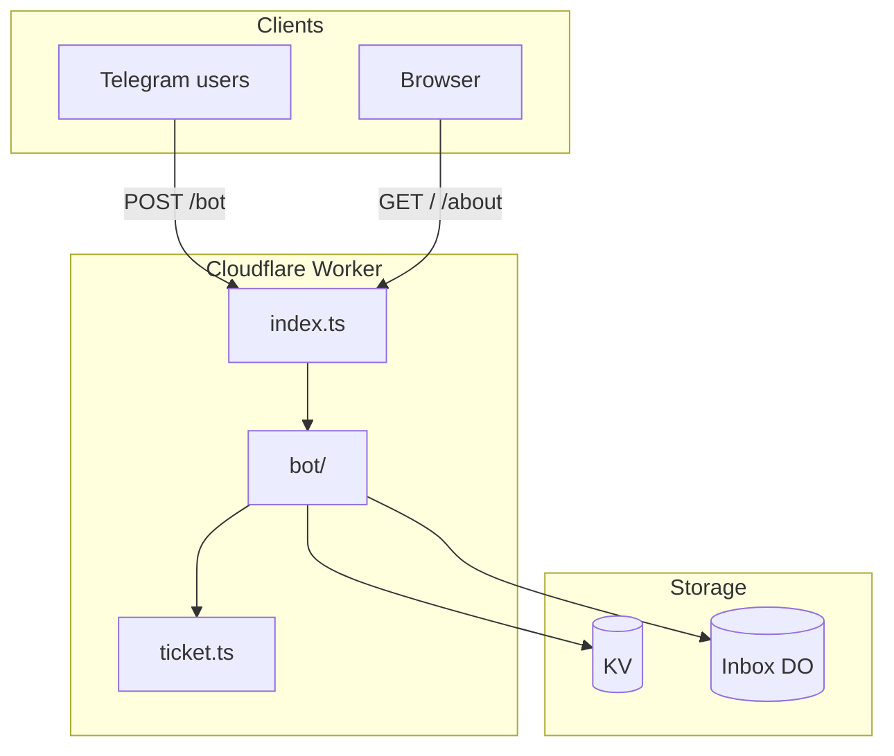

# Nekonymous

**Nekonymous** (نِکونیموس) is a Persian-first anonymous messaging bot for Telegram. Each user gets a personal link; anyone who opens it can send them a message without showing their name or username. Replies stay anonymous in both directions. The bot runs as a single [Cloudflare Worker](https://developers.cloudflare.com/workers/) with encrypted storage at the edge.

---

## Architecture

### What runs where

Everything lives in one Worker (`src/index.ts`). Telegram talks to the Worker over a signed webhook; users can also open lightweight HTML pages on the same domain.

| Layer | Technology | Role |
|-------|------------|------|
| HTTP edge | Cloudflare Worker | Routes, webhook, static HTML, ops cleanup |
| Bot runtime | [Grammy](https://grammy.dev/) | Telegram updates, commands, keyboards |
| User & metadata | Cloudflare **KV** | Profiles, UUID map, encrypted conversation blobs, stats |
| Inbox queue | **Durable Object** per recipient | Pending messages + callback refs for reply/block |
| Crypto | Web Crypto API | HKDF-SHA-256 key derivation, AES-256-GCM |



### HTTP surface

| Method | Path | Purpose |
|--------|------|---------|
| `GET` | `/` | Landing page and aggregate stats |
| `GET` | `/about` | About and privacy copy |
| `POST` | `/bot` | Telegram webhook (`BOT_SECRET_KEY` header) |
| `POST` | `/admin/cleanup` | Ops: wipe stale conversation KV + inbox DOs (`Authorization: Bearer BOT_SECRET_KEY`) |

### Storage layout

| KV key | Example | Contents |
|--------|---------|----------|
| `user:{telegramId}` | `user:123456` | Name, link UUID, block list, draft conversation |
| `userUUIDtoId:{uuid}` | `userUUIDtoId:abc…` | Shareable link token → Telegram user ID |
| `conversation:{id}` | `conversation:xY…` | Encrypted JSON (connection + payload or metadata-only after read) |
| `stats:*` | `stats:newUser:2026-06-11` | Daily counters for the home page |

| Durable Object | One per | Contents |
|----------------|---------|----------|
| `InboxDurableObject` | recipient Telegram ID | `{ ref, ticketId, conversationId, ciphertext?, delivered? }[]` |

**Anonymity:** Recipients do not see sender usernames in Telegram. The operator can map UUIDs to Telegram IDs and decrypt bodies with `APP_SECURE_KEY` — this is a hosted relay, not E2E encryption.

### Message ticket model

Each anonymous message uses a fresh random **ticket** (256-bit, base64url):

1. **Ticket** — capability handle; stored in the recipient's inbox DO.
2. **Conversation ID** — HKDF-derived KV key (domain-separated from the AES key).
3. **Ciphertext** — AES-256-GCM in KV and copied into the DO entry until delivery (`iv.ciphertext`, base64url).
4. **Ref** — 8 hex chars for Telegram inline buttons (`rpl:`, `blk:`, `ubl:` prefixes, under the 64-byte callback limit).

### Data flows

#### Send message

1. Sender writes after opening a `/start {uuid}` link.
2. Bot encrypts conversation JSON → saves to KV → enqueues in recipient's inbox DO (with ciphertext copy).
3. Sender gets confirmation; recipient gets an inbox count notification.

#### Read inbox (`/inbox`)

1. Bot lists **pending** (undelivered) DO entries.
2. Decrypts from DO ciphertext, delivers to Telegram with reply/block keyboard.
3. Notifies sender that the message was seen.
4. Clears payload in KV (keeps `connection` for reply/block), marks entry `delivered` in DO (drops ciphertext, keeps `ref`).

#### Reply / block

1. Recipient taps inline button (`rpl:{ref}` etc.).
2. Bot loads DO entry by `ref`, decrypts connection metadata from KV.
3. Reply sets a new draft conversation; block updates `blockList` in KV.

### Code map

```
src/
├── index.ts              Worker entry, routes, DO export
├── types.ts              User, Conversation, Environment
├── admin/cleanup.ts      Stale data wipe endpoint
├── bot/
│   ├── bot.ts            Grammy wiring
│   ├── commands.ts       /start, /inbox, outbound messages
│   ├── actions.ts        Inline reply / block / unblock
│   └── inboxDU.ts        Per-user inbox (Durable Object)
├── front/                Public HTML
└── utils/
    ├── ticket.ts         HKDF + AES-GCM
    ├── inbox.ts          Inbox DO client + decrypt helpers
    ├── kv-storage.ts     KVModel wrapper
    ├── user.ts           ensureUser()
    ├── payload.ts        Telegram message → conversation payload
    ├── sender.ts         Deliver decrypted media to Telegram
    ├── telegram-limits.ts  Callback size, text/caption truncation
    ├── messages.ts       Persian copy
    ├── constant.ts       Keyboards
    └── tools.ts          Rate limit, Markdown escaping
```

### Operational limits

- **Webhook auth** — `BOT_SECRET_KEY` must match Telegram `secret_token`.
- **Rate limit** — 5 seconds between link opens and sends.
- **Inbox cap** — 50 pending messages per recipient DO.
- **Callbacks** — Only `connection.to` may reply or block using a ticket ref.

---

## How It Works (user view)

1. **Get your link** — `/start` returns your personal `t.me/...?start=…` URL.
2. **Receive anonymously** — Others open your link and send; you read via `/inbox`.
3. **Reply or block** — Use **پاسخ** / **بلاک** on each delivered message.
4. **Protection** — Rate limits, self-message blocking, and per-sender block lists.

---

## Getting Started

### Prerequisites

- **Node.js** 22+
- **pnpm** 9+
- **Cloudflare account** (Workers, KV, Durable Objects)
- **`wrangler.toml`** in the project root (gitignored locally)

### Install

```bash
pnpm install
```

### Secrets

Copy `.env.example` to `.dev.vars` and fill in:

- `SECRET_TELEGRAM_API_TOKEN` — from @BotFather
- `BOT_SECRET_KEY` — random string for webhook validation
- `APP_SECURE_KEY` — long random string for message encryption
- `BOT_INFO` — JSON `result` from `getMe`
- `BOT_NAME` — shown on public pages

Set the same values as Wrangler secrets for production (`wrangler secret put …`).

### Local worker

```bash
pnpm dev
```

Runs Wrangler on port 8787. Telegram will not reach a local worker unless you point the bot webhook at a public URL yourself.

### Quality checks

```bash
pnpm check
```

Runs typecheck, lint, knip, and crypto roundtrip tests. CI runs this on every push and pull request.

### Deploy

```bash
pnpm deploy
```

Pushes to `master` also deploy via GitHub Actions (`CF_API_TOKEN`, `CF_ACCOUNT_ID`, `CF_ZONE_ID`).

### Stale data cleanup

```bash
WORKER_URL=https://your-worker.example.com BOT_SECRET_KEY=... pnpm cleanup
```

Calls `POST /admin/cleanup` to delete all `conversation:*` KV keys and purge inbox Durable Objects for known users.

---

## Security Overview

- **Encryption at rest** — AES-256-GCM; per-ticket keys via HKDF-SHA-256 (`APP_SECURE_KEY` + ticket salt).
- **Webhook** — Requests must include `X-Telegram-Bot-Api-Secret-Token: BOT_SECRET_KEY`.
- **Ticket auth** — Reply/block callbacks resolve through the recipient's inbox DO; `connection.to` is verified server-side.
- **Payload lifecycle** — Message content is cleared from KV after inbox delivery; connection metadata remains for threading.

See [AGENTS.md](AGENTS.md) for contributor conventions.
