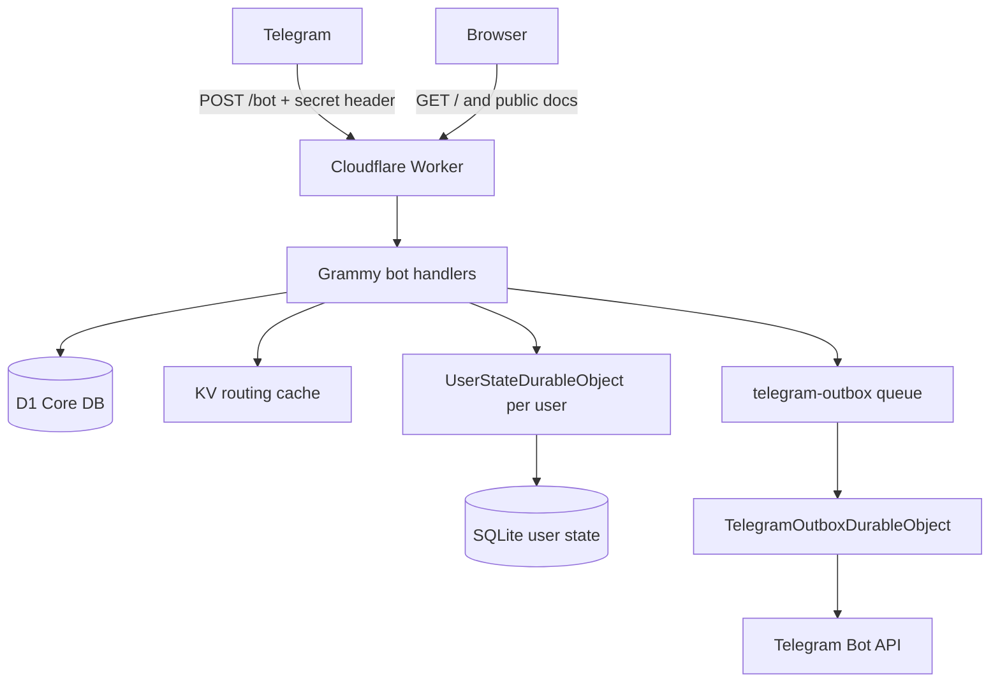
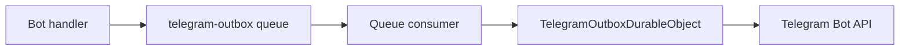

# Nekonymous

**Nekonymous** / **نِکونیموس** is a Persian-first anonymous messaging bot for Telegram.

Each user receives a personal Telegram deep link. Other people can open that link and send a message without seeing the owner's Telegram username. The owner can read messages from `/inbox`, reply anonymously, block senders, pause new incoming messages, report abuse, and keep private nicknames for repeat senders.

The project started as a small anonymous relay: one Telegram bot, one Cloudflare Worker, encrypted message storage, and a bounded inbox. The new V1 keeps the same product surface, but rebuilds the storage and ticketing core around a cleaner Cloudflare-native architecture:

- **D1** for identity, public links, conversation summaries, reports, and consent records.
- **SQLite-backed Durable Objects** for hot per-user state, inbox tickets, drafts, blocks, labels, rate limits, and idempotency.
- **KV** only for routing/cache.
- **Cloudflare Queues** for non-critical outbound Telegram sends.
- **A Telegram Outbox Durable Object** for idempotent delivery and future rate limiting.

This refactor intentionally treats old data as disposable. The goal is not backward compatibility with legacy KV records; the goal is a clean V1 core that can become a real product.

---

## Product Scope

Nekonymous is a hosted anonymous relay for Telegram.

Core user flow:

1. A user starts the bot.
2. The bot creates a personal deep link.
3. Another person opens the link and writes a message.
4. The owner reads pending messages with `/inbox`.
5. The owner can reply anonymously, block/report the sender, pause new messages, or assign a private nickname.

Nekonymous is intentionally not:

- a full social network,
- a helpdesk,
- a dating platform,
- a full encrypted messenger,
- a moderation platform,
- a heavy frontend application,
- an AI matching system,
- a payment/wallet system.

Those features may be explored later. The V1 refactor focuses on the anonymous relay core.

---

## Privacy Model

Nekonymous is a **hosted anonymous relay**, not end-to-end encryption.

What the system protects:

- Senders and recipients do not see each other's Telegram username through the bot UI.
- Message payloads are encrypted before being stored.
- Message payloads are cleared after `/inbox` delivery.
- Only encrypted connection metadata remains for reply/block/report/nickname actions.
- Telegram raw user IDs are not used as public ticket references.
- Callback refs are short, opaque, and scoped to the recipient's state object.

What the system does **not** claim:

- Telegram still receives the original user messages because this is a Telegram bot.
- The Worker sees plaintext while processing a message, then encrypts it at rest.
- A Cloudflare/operator account that can change Worker code or access runtime secrets can compromise future messages.
- Runtime secrets such as `APP_MASTER_KEY` are part of the trust boundary.
- This is not end-to-end encryption.

The honest security goal is:

> Minimize stored plaintext and user-visible identity leakage while keeping the relay fast, bounded, and operationally simple.

---

## Architecture

### Runtime Shape

| Layer | Technology | Role |
|---|---|---|
| Edge entry | Cloudflare Worker | HTTP router, Telegram webhook, public pages |
| Bot framework | Grammy | Commands, messages, and inline callbacks |
| Source of truth | Cloudflare D1 | Users, links, conversation summaries, reports, consents |
| Hot user state | SQLite Durable Object | Drafts, inbox tickets, blocks, labels, rate limits, processed events |
| Routing cache | Cloudflare KV | `tg:{hash} -> userId`, `link:{slug} -> userId`, config/cache |
| Async send path | Cloudflare Queue | Non-critical outbound Telegram jobs |
| Outbox coordination | Durable Object | Idempotent Telegram sends and future rate limits |
| Crypto | Web Crypto API | HMAC, HKDF-SHA-256, AES-256-GCM, secure random IDs |



### Design Principles

- Keep webhook handlers low-CPU and low-memory.
- Keep user-facing bot behavior stable.
- Use D1 for relational source-of-truth records.
- Use a per-user Durable Object where ordering, serialization, and consistency matter.
- Use KV only for read-heavy routing and cache.
- Use Queues for non-critical outbound sends.
- Keep callback data short and opaque.
- Never put sensitive metadata into Telegram `callback_data`.
- Store message payloads encrypted at rest.
- Clear payloads after inbox delivery.
- Avoid unnecessary components until a product need appears.

---

## Storage Responsibility

| Data | Store | Reason |
|---|---|---|
| User identity | D1 | queryable source of truth |
| Telegram user hash | D1 + KV cache | stable internal lookup |
| Encrypted Telegram chat id | D1 | needed for outbound sends |
| Public deep link slug | D1 + KV cache | source of truth + fast lookup |
| Draft compose state | UserStateDO | hot mutable per-user state |
| Pause state | UserStateDO | checked in message hot path |
| Block list | UserStateDO | checked before accepting a message |
| Private nicknames | UserStateDO | recipient-scoped private state |
| Pending inbox tickets | UserStateDO | ordered, bounded, per-recipient queue |
| Delivered ticket metadata | UserStateDO | reply/block/report/nickname continuity |
| Message payload ciphertext | UserStateDO | temporary encrypted payload |
| Conversation summary | D1 | count/timeline/index only |
| Reports | D1 | moderation/audit index |
| Outbound Telegram jobs | Queue + OutboxDO | async delivery and idempotency |
| Config/routing cache | KV | read-heavy low-latency lookups |

KV is no longer the authority for users, conversations, message payloads, drafts, blocks, or stats.

---

## HTTP Surface

| Method | Path | Auth | Purpose |
|---|---|---|---|
| `GET` | `/` | none | Persian landing page |
| `GET` | `/about` | none | Product/privacy explanation |
| `GET` | `/about/technical` | none | Technical architecture guide |
| `POST` | `/bot` | `X-Telegram-Bot-Api-Secret-Token` = `BOT_SECRET_KEY` | Telegram webhook |

`POST /bot` must verify the Telegram webhook secret header before doing sensitive work.

---

## D1 Core Data Model

D1 stores source-of-truth records that need relational querying, auditability, or future product visibility.

### `users`

| Column | Meaning |
|---|---|
| `id` | internal user id |
| `telegram_user_hash` | HMAC of Telegram user id |
| `telegram_chat_ciphertext` | encrypted Telegram chat id |
| `locale` | user-selected bot language |
| `locale_source` | `explicit`, `telegram`, or `fallback` |
| `onboarding_completed` | whether initial setup is complete |
| `status` | active/disabled/deleted |
| `bucket_id` | future sharding/indexing aid |
| `created_at`, `updated_at` | timestamps |

### `public_links`

| Column | Meaning |
|---|---|
| `slug` | public deep-link token |
| `owner_user_id` | link owner |
| `is_active` | link status |
| `expires_at` | optional expiration |
| `created_at`, `updated_at` | timestamps |

### `conversations`

This table is a summary/index only. It does not store message bodies.

| Column | Meaning |
|---|---|
| `id` | stable pair/conversation id |
| `type` | `anonymous_relay` |
| `user_a_id`, `user_b_id` | participants |
| `status` | active/closed/blocked |
| `message_count` | aggregate count |
| `report_count` | aggregate report count |
| `last_event_at` | timeline sorting |
| `created_at`, `updated_at` | timestamps |

### `reports`

| Column | Meaning |
|---|---|
| `id` | report id |
| `reporter_user_id` | reporter |
| `reported_user_id` | reported user if known |
| `conversation_id` | related conversation summary |
| `ticket_ref` | recipient-scoped ticket ref |
| `reason_code` | report reason |
| `details_ciphertext` | optional encrypted details |
| `status` | open/reviewed/closed |
| `created_at`, `reviewed_at` | timestamps |

### `consents`

Reserved for privacy, matching, or future product consents.

| Column | Meaning |
|---|---|
| `id` | consent record id |
| `user_id` | user |
| `consent_type` | consent kind |
| `version` | consent text/version |
| `accepted_at`, `revoked_at` | timestamps |

---

## UserState Durable Object

`UserStateDurableObject` is addressed by internal user id:

```ts
env.USER_STATE_DO.get(env.USER_STATE_DO.idFromName(userId))
```

It owns all hot mutable state for one user.

### Internal SQLite tables

#### `user_state`

Stores per-user runtime state:

- locale,
- onboarding status,
- pause state,
- encrypted display name if needed.

#### `drafts`

Stores active compose/reply/nickname flows:

| Column | Meaning |
|---|---|
| `id` | draft id |
| `mode` | `new_message`, `reply`, `nickname`, etc. |
| `to_user_id` | target user |
| `link_slug` | source link |
| `reply_ref` | ticket being replied to |
| `parent_message_id` | Telegram message context |
| `reply_to_message_id` | Telegram reply context |
| `pending_nickname_alias` | nickname flow state |
| `expires_at` | draft TTL |

#### `inbox_tickets`

This is the core ticketing table.

| Column | Meaning |
|---|---|
| `ref` | short callback reference, recipient-scoped |
| `ticket_id` | long internal cryptographic ticket id |
| `sender_user_id` | sender internal id |
| `recipient_user_id` | recipient internal id |
| `conversation_id` | D1 conversation summary id |
| `payload_ciphertext` | encrypted message payload; cleared after delivery |
| `connection_ciphertext` | encrypted metadata for reply/block/report/nickname |
| `status` | `pending`, `delivered`, `deleted`, etc. |
| `created_at` | inbox ordering |
| `delivered_at` | delivery timestamp |
| `replied_at` | reply action timestamp |
| `blocked_at` | block action timestamp |
| `reported_at` | report action timestamp |
| `deleted_at` | deletion timestamp |
| `expires_at` | ticket TTL |
| `dedupe_key` | idempotency key for duplicate update protection |

#### `blocks`

Recipient-scoped blocked senders.

#### `contact_labels`

Private nicknames for repeated senders. These labels are private to the recipient and are not public identity.

#### `rate_limits`

Per-user token buckets or cooldown states.

#### `processed_events`

Per-user idempotency keys such as Telegram update ids or callback ids.

---

## Ticketing Model

A ticket is not a support ticket. In Nekonymous, a ticket is:

> A recipient-scoped, encrypted, action-capable anonymous message reference.

Each accepted message creates exactly one ticket inside the recipient's `UserStateDO`.

```text
sender message
  -> encrypted payload
  -> encrypted connection metadata
  -> recipient UserStateDO inbox_tickets row
```

### Ticket identifiers

| Identifier | Purpose |
|---|---|
| `ticket_id` | internal cryptographic identifier, never exposed |
| `ref` | short opaque callback reference |
| `conversation_id` | D1 summary/index id |
| `dedupe_key` | prevents duplicate ticket creation |

Callback data remains short:

```text
r:{ref}   reply
b:{ref}   block
rp:{ref}  report
n:{ref}   nickname
```

The callback data is not trusted. Every callback must resolve the `ref` inside the current user's `UserStateDO` and verify ownership.

---

## Crypto Design

Nekonymous uses Web Crypto APIs in the Worker runtime.

### Secrets

| Secret | Purpose |
|---|---|
| `SECRET_TELEGRAM_API_TOKEN` | Telegram bot token |
| `BOT_SECRET_KEY` | webhook secret header validation |
| `APP_MASTER_KEY` | master input key material for encryption |
| `APP_HMAC_PEPPER` | HMAC key for Telegram id hashing |

### Algorithms

| Operation | Algorithm |
|---|---|
| Telegram id hashing | HMAC-SHA-256 |
| Key derivation | HKDF-SHA-256 |
| Encryption | AES-256-GCM |
| IV | random 96-bit IV per encryption |
| Ticket ids | secure random bytes |
| Callback refs | short secure random opaque ids |

### Per-ticket key separation

For every accepted message, create a fresh `ticket_id`.

Use HKDF with:

```text
IKM  = APP_MASTER_KEY
salt = ticket_id
```

Use different HKDF info labels for separate purposes:

| Purpose | HKDF info |
|---|---|
| payload encryption | `nekonymous:ticket:payload:v1` |
| connection metadata encryption | `nekonymous:ticket:connection:v1` |
| sender alias derivation | `nekonymous:ticket:alias:v1` |

### Cipher envelope

Prefer a versioned envelope:

```json
{
  "v": 1,
  "kid": "k1",
  "iv": "base64url",
  "ct": "base64url"
}
```

AAD should bind ciphertext to context:

```text
purpose
ticket_id
sender_user_id
recipient_user_id
conversation_id
schema_version
```

This prevents ciphertext from being moved across tickets or users without authentication failure.

---

## Message Lifecycle

### 1. Register or get link

`/start` without payload:

1. Verify webhook secret.
2. Resolve Telegram user.
3. Compute `telegram_user_hash`.
4. Look up `tg:{telegram_user_hash}` in KV.
5. If cache miss, query D1 `users`.
6. If missing, create a new internal user id.
7. Encrypt Telegram chat id.
8. Insert D1 `users`.
9. Create a public link slug.
10. Insert D1 `public_links`.
11. Cache `tg:{hash} -> userId`.
12. Cache `link:{slug} -> userId`.
13. Initialize `UserStateDO`.
14. Show language picker if onboarding is not complete.
15. Otherwise show personal link.

### 2. Open someone's link

`/start {slug}`:

1. Resolve slug from KV.
2. Fallback to D1 `public_links` if the cache misses.
3. Reject missing/inactive links.
4. Reject self-message.
5. Ask recipient `UserStateDO` whether the sender can send.
6. Store sender draft in sender `UserStateDO`.
7. Send a compose prompt.

### 3. Send anonymous message

When the sender writes the message:

1. Resolve sender.
2. Load sender draft from `UserStateDO`.
3. Check sender rate limit.
4. Check recipient pause/block state via recipient `UserStateDO`.
5. Reject unsupported payload types before encryption.
6. Create `ticket_id`, `ref`, `conversation_id`, and `dedupe_key`.
7. Build message payload.
8. Build connection metadata.
9. Encrypt payload and connection metadata separately.
10. Insert ticket into recipient `UserStateDO`.
11. Clear sender draft.
12. Upsert D1 conversation summary.
13. Confirm to sender.
14. Enqueue recipient notification through `telegram-outbox`.

### 4. Read inbox

`/inbox`:

1. Resolve recipient.
2. Load pending `inbox_tickets` from recipient `UserStateDO`.
3. Decrypt payloads.
4. Render messages in the recipient's locale.
5. Send messages to Telegram with inline actions.
6. Mark tickets as delivered.
7. Set `payload_ciphertext = NULL`.
8. Keep `connection_ciphertext`.

After delivery, message content is no longer stored, but reply/block/report/nickname can still work.

### 5. Reply

`r:{ref}`:

1. Resolve current user.
2. Load ticket from current user's `UserStateDO`.
3. Verify ownership.
4. Decrypt connection metadata.
5. Store a reply draft in current user's `UserStateDO`.
6. When the user sends text, create a new ticket for the original sender.

Replies are not a separate storage model. A reply is just a new ticket in the other user's inbox.

### 6. Block

`b:{ref}`:

1. Resolve current user.
2. Load ticket.
3. Verify ownership.
4. Decrypt connection metadata.
5. Add `sender_user_id` to current user's `blocks`.
6. Mark `blocked_at`.
7. Future messages from that sender are rejected.

### 7. Report

`rp:{ref}`:

1. Resolve current user.
2. Load ticket.
3. Verify ownership.
4. Decrypt connection metadata.
5. Ask for or infer a reason code.
6. Insert D1 `reports`.
7. Mark `reported_at`.

By default, reports do not store plaintext message bodies. If extra details are captured, they must be encrypted.

### 8. Private nickname

`n:{ref}`:

1. Resolve current user.
2. Load ticket.
3. Verify ownership.
4. Decrypt connection metadata.
5. Ask for a nickname.
6. Store encrypted nickname in `contact_labels`.

Nicknames are private to the recipient.

---

## Outbox Queue

Immediate command responses can still be sent directly.

Non-critical outbound messages go through the queue:

- recipient pending notification,
- seen notification,
- reminders,
- future batch notifications.



### `TelegramOutboxJob`

```ts
export type TelegramOutboxJob = {
  idempotencyKey: string

  chatCiphertext: string
  chatHash: string

  method: 'sendMessage' | 'editMessageText' | 'answerCallbackQuery'

  payload: {
    text?: string
    parse_mode?: 'HTML'
    reply_markup?: unknown
    callback_query_id?: string
  }

  priority: 'normal' | 'low'
  createdAt: number
}
```

### Outbox idempotency

`TelegramOutboxDurableObject` stores `sent_events`.

If a queue message is delivered more than once, the outbox checks `idempotency_key` and avoids duplicate Telegram sends.

This matters because queue delivery is reliable but not exactly-once. The application must make processing idempotent.

---

## Multilingual Behavior

Nekonymous is Persian-first, but the V1 architecture supports per-user locale.

Rules:

- On first `/start`, show a language picker.
- Store `locale` in D1 and `UserStateDO`.
- Telegram `language_code` may be used as a suggestion, not as final truth.
- User-generated message content is not automatically translated.
- Bot-generated wrappers, buttons, errors, settings, inbox labels, and future tests/match cards are rendered in the recipient's locale.
- `/language` lets the user change locale.

Example:

If a Persian sender writes:

```text
سلام، حالت چطوره؟
```

and the recipient uses English, the bot renders:

```text
Anonymous message:

سلام، حالت چطوره؟

[Reply] [Block] [Report]
```

The payload stays in the original language. The bot UI wrapper changes.

---

## Security and Performance Review

### What this architecture improves

- KV is no longer the authority for hot mutable user state.
- Message payloads are no longer stored as KV conversation blobs.
- Inbox ordering and ticket actions live in one per-recipient authority.
- Payload and connection metadata are encrypted separately.
- Payloads are cleared after delivery.
- Callback ownership is checked against the recipient's `UserStateDO`.
- Outbound notifications can be retried safely and idempotently.
- D1 can be queried for product/admin summaries without touching message bodies.
- The bot core remains small: no unnecessary AI/payment/search components in V1.

### Remaining tradeoffs

- This is still a hosted relay, not E2EE.
- Telegram and the Worker see plaintext during processing.
- Runtime secrets are part of the trust boundary.
- Delivered tickets keep encrypted connection metadata for a limited time.
- Reports do not include message text by default, which improves privacy but limits moderation context.
- Queue delivery requires idempotent consumers.
- D1 is not used for hot inbox payloads by design.

---

## Project Map

Expected structure after the V1 core refactor:

```text
src/
├── index.ts
├── types.ts
├── bot/
│   ├── bot.ts
│   ├── commands.ts
│   ├── actions.ts
│   ├── settings.ts
│   └── language.ts
├── front/
│   ├── layout.ts
│   ├── home.ts
│   ├── about.ts
│   └── technical.ts
├── services/
│   ├── identity-service.ts
│   ├── user-state-service.ts
│   ├── message-service.ts
│   ├── outbox-service.ts
│   ├── conversation-summary-service.ts
│   ├── report-service.ts
│   ├── crypto-service.ts
│   └── locale-service.ts
├── storage/
│   ├── d1/
│   │   ├── users.ts
│   │   ├── links.ts
│   │   ├── conversations.ts
│   │   └── reports.ts
│   └── durable/
│       ├── user-state-do.ts
│       └── telegram-outbox-do.ts
├── queues/
│   ├── types.ts
│   └── telegram-outbox.consumer.ts
├── utils/
│   ├── payload.ts
│   ├── sender.ts
│   ├── worker.ts
│   ├── tools.ts
│   ├── constant.ts
│   └── messages*.ts
└── i18n/
    ├── index.ts
    └── locales/
        ├── fa.ftl
        └── en.ftl

migrations/
└── 0001_core.sql

tools/
└── verify-crypto.ts
```

The exact filenames can differ, but storage responsibilities should remain the same.

---

## Local Setup

### Requirements

- Node.js 22+
- pnpm
- Cloudflare account with Workers, D1, KV, Durable Objects, and Queues enabled
- Telegram bot token from BotFather

### Install

```bash
pnpm install
```

### Runtime Secrets

Local development uses `.dev.vars` with Wrangler. Production uses Wrangler secrets.

| Variable | Purpose |
|---|---|
| `SECRET_TELEGRAM_API_TOKEN` | Telegram bot token |
| `BOT_SECRET_KEY` | Telegram webhook secret token |
| `APP_MASTER_KEY` | encryption master key material |
| `APP_HMAC_PEPPER` | HMAC key for Telegram id hashing |
| `BOT_INFO` | JSON result compatible with Grammy `botInfo` |
| `BOT_NAME` | public bot display name |
| `BOT_USERNAME` | Telegram bot username without `@` |
| `PUBLIC_SITE_URL` | public Worker origin |
| `PRODUCTION_WEBHOOK_URL` | Telegram webhook URL |

Never commit filled `.env`, `.dev.vars`, Telegram tokens, or runtime secrets.

Production secret setup:

```bash
wrangler secret put SECRET_TELEGRAM_API_TOKEN
wrangler secret put BOT_SECRET_KEY
wrangler secret put APP_MASTER_KEY
wrangler secret put APP_HMAC_PEPPER
wrangler secret put BOT_USERNAME
```

---

## Wrangler Bindings

Example `wrangler.toml` shape:

```toml
name = "nekonymous"
main = "src/index.ts"
compatibility_date = "2026-06-16"

[vars]
PUBLIC_SITE_URL = "https://nekonymous.mohetios.dev"

[[kv_namespaces]]
binding = "NEKO_KV"
id = "YOUR_KV_NAMESPACE_ID"

[[d1_databases]]
binding = "DB"
database_name = "nekonymous_core"
database_id = "YOUR_D1_DATABASE_ID"

[[queues.producers]]
binding = "TELEGRAM_OUTBOX_QUEUE"
queue = "telegram-outbox"

[[queues.consumers]]
queue = "telegram-outbox"
max_batch_size = 25
max_batch_timeout = 2
max_retries = 5
dead_letter_queue = "dead-letter"

[durable_objects]
bindings = [
  { name = "USER_STATE_DO", class_name = "UserStateDurableObject" },
  { name = "TELEGRAM_OUTBOX_DO", class_name = "TelegramOutboxDurableObject" }
]

[[migrations]]
tag = "v1-clean-core"
new_sqlite_classes = [
  "UserStateDurableObject",
  "TelegramOutboxDurableObject"
]
```

---

## Fresh Database Setup

Create the D1 database:

```bash
wrangler d1 create nekonymous_core
```

Apply migrations locally:

```bash
wrangler d1 migrations apply nekonymous_core --local
```

Apply migrations remotely:

```bash
wrangler d1 migrations apply nekonymous_core --remote
```

Because V1 treats old data as disposable, no legacy data migration is required.

---

## Telegram Webhook

Set the webhook:

```bash
curl -X POST "https://api.telegram.org/bot<TOKEN>/setWebhook"   -H "Content-Type: application/json"   -d '{
    "url": "https://nekonymous.mohetios.dev/bot",
    "secret_token": "<BOT_SECRET_KEY>",
    "allowed_updates": ["message", "callback_query"],
    "max_connections": 80
  }'
```

`secret_token` makes Telegram include the `X-Telegram-Bot-Api-Secret-Token` header in webhook requests.

---

## Commands

```bash
pnpm dev          # local Wrangler dev server
pnpm typecheck    # TypeScript only
pnpm lint         # ESLint
pnpm knip         # unused files/exports/deps
pnpm test:crypto  # crypto smoke test
pnpm check        # all checks above
pnpm deploy       # production deploy
```

Use the actual package scripts if they differ.

---

## Operational Checklist

Before deploying a bot/crypto/storage change:

- `pnpm check` passes.
- `/bot` validates Telegram webhook secret before sensitive work.
- No plaintext message bodies are stored in D1, KV, DO storage, or logs.
- No logs include ticket ids, decrypted payloads, Telegram tokens, or runtime secrets.
- Message accept path checks pause, block, and rate-limit before inserting a ticket.
- `/inbox` clears `payload_ciphertext` after delivery.
- Callback handlers verify ticket ownership.
- Queue consumers are idempotent.
- Outbox duplicate jobs do not duplicate Telegram sends.
- KV only stores routing/cache records.
- D1 contains no message body plaintext.
- Durable Object queries are bounded.
- Static public pages fail soft on external fetches.

---

## Testing Checklist

Manual tests for a fresh environment:

1. Fresh `/start`
2. Language selection
3. Personal link creation
4. Open `/start {slug}` from another Telegram account
5. Compose anonymous text message
6. Receiver `/inbox`
7. Receiver reply
8. Original sender reads reply
9. Receiver blocks sender
10. Blocked sender cannot send again
11. Pause receiving
12. Resume receiving
13. Private nickname flow
14. Report flow
15. Duplicate update does not create duplicate ticket
16. Duplicate outbox job does not send duplicate Telegram message
17. D1 users/public_links/conversations/reports rows are created
18. UserStateDO contains drafts/tickets/blocks/labels as expected
19. KV only contains routing/cache keys
20. No plaintext body appears in logs/storage

---

## Future Roadmap

After the clean V1 core is stable:

1. Personality test and compatibility profile.
2. Locale-aware anonymous matching.
3. Workers AI and Vectorize for candidate discovery/explanations.
4. Telegram Stars credit packages for paid AI matching.
5. Admin/moderation view.
6. Better public docs and self-hosting guide.

These are intentionally outside the core refactor. The first job is to make the anonymous relay stable, bounded, and honest.