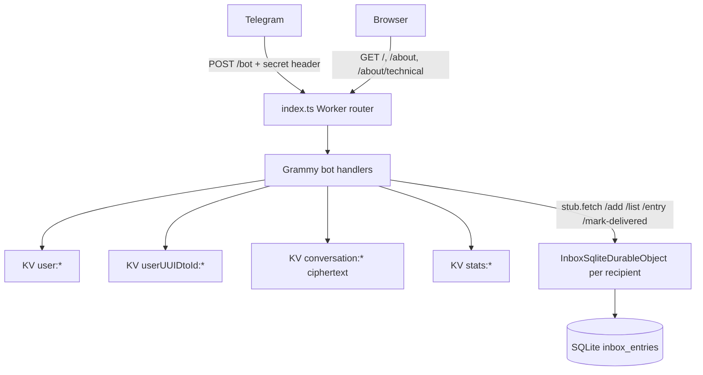

# Nekonymous

**Nekonymous** / **نِکونیموس** is a Persian-first anonymous messaging bot for Telegram.

Each user receives a personal Telegram deep link. Other people can open that link and send a message without seeing the owner's Telegram username. The owner can read messages from `/inbox`, reply anonymously, block senders, pause new incoming messages, and keep private nicknames for repeat senders.

The implementation is intentionally small: one Cloudflare Worker, Grammy for Telegram webhook handling, Cloudflare KV for profiles and encrypted blobs, and one SQLite-backed Durable Object inbox per recipient.

---

## Privacy Model

Nekonymous is a **hosted anonymous relay**, not end-to-end encryption.

What the system protects:

- Recipients and senders do not see each other's Telegram username through the bot UI.
- Message bodies are encrypted before being stored in KV or Durable Object storage.
- A storage-only attacker who has KV/DO data but not `APP_SECURE_KEY` cannot decrypt message bodies.
- After `/inbox` delivery, the plaintext payload is cleared from KV; only encrypted connection metadata remains for reply/block/nickname callbacks.

What the system does **not** claim:

- Telegram still receives the original user messages, because this is a Telegram bot.
- The Worker sees plaintext while processing a message, then encrypts it at rest.
- A Cloudflare/operator account that can change Worker code or access runtime secrets can compromise future messages.
- An operator with `APP_SECURE_KEY` plus stored `ticketId`/ciphertext can decrypt stored conversations.
- Some metadata is intentionally stored in plaintext: user records, link UUID map, block lists, paused state, private nickname map, and active draft state.

The honest security goal is: **minimize stored plaintext and user-visible identity leakage while keeping the relay fast and operationally simple.**

---

## Architecture

### Runtime Shape

| Layer | Technology | Role |
|---|---|---|
| Edge entry | Cloudflare Workers | HTTP router, Telegram webhook, static HTML pages |
| Bot framework | Grammy | `/start`, `/inbox`, `/settings`, message handling, inline callbacks |
| User/profile store | Cloudflare KV | JSON records for users, UUID mapping, settings, stats |
| Ciphertext store | Cloudflare KV | Opaque AES-GCM blobs under `conversation:{conversationId}` |
| Inbox queue | Durable Object + SQLite | One inbox object per recipient; FIFO pending messages and callback refs |
| Crypto | Web Crypto API | HKDF-SHA-256, AES-256-GCM, secure random ticket/link IDs |



### Design Principles

- Keep webhook paths low-CPU and low-memory.
- Prefer Web APIs and Cloudflare bindings over extra dependencies.
- Use KV for simple eventually-consistent records.
- Use a per-user Durable Object only where ordering and serialization matter.
- Store message bodies encrypted at rest; never store decrypted payloads in KV or DO.
- Keep Telegram copy Persian-first and user-safe.
- Avoid framework growth: no SPA, no D1, no Queues, no second Worker.

---

## HTTP Surface

| Method | Path | Auth | Purpose |
|---|---|---|---|
| `GET` | `/` | none | Persian landing page and public aggregate stats |
| `GET` | `/about` | none | Product/privacy explanation |
| `GET` | `/about/technical` | none | Persian technical architecture guide |
| `POST` | `/bot` | `X-Telegram-Bot-Api-Secret-Token` = `BOT_SECRET_KEY` | Telegram webhook |

`POST /bot` checks the Telegram secret before parsing webhook JSON, and still passes `secretToken` to Grammy's Cloudflare webhook adapter.

---

## Core Data Model

### KV Namespaces

`KVModel<T>` stores every key as `{namespace}:{id}`.

| Key | Format | Contents |
|---|---|---|
| `user:{telegramId}` | JSON `User` | Display name, link UUID, `blockList`, `paused`, `contactLabels`, settings state, active draft |
| `userUUIDtoId:{uuid}` | JSON string | Public link token to owner Telegram ID |
| `conversation:{conversationId}` | text | Opaque AES-GCM ciphertext, never JSON-parsed |
| `stats:newUser:YYYY-MM-DD` | JSON number | Daily registrations |
| `stats:newConversation:YYYY-MM-DD` | JSON number | Daily successful sends |
| `stats:total:newUser` | JSON number | Homepage running total |
| `stats:total:newConversation` | JSON number | Homepage running total |

Stats are useful product counters, not a billing ledger. KV read-modify-write can lose increments under concurrency, so exact accounting would need a different counter authority.

### Inbox Durable Object

`InboxSqliteDurableObject` is addressed by recipient Telegram ID:

```ts
env.INBOX_DO.get(env.INBOX_DO.idFromName(recipientId.toString()))
```

SQLite table: `inbox_entries`

| Column | Meaning |
|---|---|
| `ref` | 8 hex chars used in inline callbacks: `rpl:`, `blk:`, `ubl:`, `nnk:` |
| `ticket_id` | Random 256-bit ticket used as HKDF salt |
| `conversation_id` | HKDF-derived KV key |
| `ciphertext` | Pending encrypted payload copy; set to `NULL` after delivery |
| `delivered` | `0` for pending, `1` after `/inbox` delivery |
| `created_at` | FIFO ordering and old delivered-ref pruning |

Internal DO routes:

| Method | Path | Behavior |
|---|---|---|
| `POST` | `/add` | Enqueue pending ciphertext; reject only when 50 pending messages already exist |
| `GET` | `/list` | Return pending rows with ciphertext, ordered by `created_at` |
| `GET` | `/entry?ref=` | Return a single row for callbacks, pending or delivered |
| `POST` | `/mark-delivered` | Clear ciphertext and mark delivered |
| `DELETE` | `/purge` | Delete inbox rows and DO storage |

Inbox storage is capped at 50 rows. When adding a new message and the table is full, the DO prunes the oldest delivered refs first. If all 50 rows are still pending, the sender receives the inbox-full message and the just-written KV ciphertext is removed.

---

## Ticket And Crypto Design

Each successfully accepted message gets a fresh random ticket:

```text
ticketId = crypto.getRandomValues(32 bytes) -> base64url
```

The ticket is not a password by itself. It is used as the HKDF salt with `APP_SECURE_KEY` as input key material.

| Derived value | HKDF info | Use |
|---|---|---|
| AES key | `nekonymous:aes:v1` | AES-256-GCM message encryption/decryption |
| Conversation ID | `nekonymous:conversation:v1` | KV key suffix for the ciphertext blob |
| Sender alias | `nekonymous:label:v1:{senderId}` | Recipient-scoped nickname map key |

Ciphertext wire format:

```text
{iv_base64url}.{ciphertext_base64url}
```

Properties:

- 12-byte random IV per encryption.
- AES-GCM authentication protects ciphertext integrity.
- Different HKDF info labels separate AES keys, KV IDs, and nickname aliases.
- `APP_SECURE_KEY` must have at least 32 bytes of entropy in production.
- The implementation uses Web Crypto only, not Node `crypto`.

---

## Message Lifecycle

### 1. Register Or Get Link

`/start` without payload:

1. `ensureUser` reads or creates `user:{telegramId}`.
2. A 128-bit random link ID is saved as `userUUIDtoId:{uuid}`.
3. The user receives `https://t.me/{BOT_USERNAME}?start={uuid}`.
4. `stats:newUser:*` and `stats:total:newUser` are incremented in `waitUntil`.

New users are not marked as rate-limited at creation; the 5-second rate limit starts after a successful send or settings write.

### 2. Open Someone's Link

`/start {uuid}`:

1. Validate UUID shape: 20-24 URL-safe base64 chars.
2. Resolve owner through `userUUIDtoId:{uuid}`.
3. Reject missing link, self-message, blocked sender, or paused recipient.
4. Send a Persian compose prompt.
5. Store active draft in sender profile: `currentConversation.to = ownerId`.

### 3. Send Anonymous Message

When the sender replies to the compose prompt:

1. Menu/settings/pending nickname inputs are handled first.
2. Server-side checks run again: rate limit, block list, recipient pause.
3. Unsupported message types are rejected before encryption and do not create inbox rows.
4. A `Conversation` JSON object is created with `connection` metadata and payload.
5. `encryptConversationPayload(ticketId, json, APP_SECURE_KEY)` returns `conversationId` and ciphertext.
6. Ciphertext is saved to KV: `conversation:{conversationId}`.
7. The same ciphertext is copied to the recipient DO with `ticketId` and `conversationId`.
8. If DO enqueue fails because the inbox is full, the KV ciphertext is deleted.
9. Sender gets a sent confirmation; recipient gets a pending count.
10. Sender draft is cleared; `newConversation` stats increment after actual send.

Supported payloads: text, photo, video, animation, document, sticker, voice, video note, audio, and captions where Telegram supports them.

### 4. Read Inbox

`/inbox`:

1. Recipient Worker handler calls DO `GET /list`.
2. Each pending row is decrypted from the DO ciphertext copy.
3. The bot sends the plaintext to Telegram with inline buttons.
4. The original sender receives a best-effort "seen" notification.
5. KV is re-encrypted with the same `connection` but empty `payload`.
6. DO row is marked delivered and its ciphertext is set to `NULL`.

After delivery, reply/block/nickname callbacks can still work because the DO keeps `ref`, `ticketId`, and `conversationId`, and KV keeps encrypted connection metadata.

### 5. Inline Actions

Callback data is limited to short refs:

```text
rpl:{ref}  reply
blk:{ref}  block
ubl:{ref}  unblock
nnk:{ref}  private nickname
```

For every callback:

1. The handler resolves `ref` in the current user's inbox DO.
2. It fetches `conversation:{conversationId}` from KV.
3. It decrypts with `ticketId` and `APP_SECURE_KEY`.
4. It verifies `conversation.connection.to === ctx.from.id`.

Only the recipient can act on a message ref. Old delivered refs may eventually expire when the inbox prunes them to keep the table bounded.

### 6. Settings And Account Lifecycle

| Action | Behavior |
|---|---|
| Display name | Saved to `user.userName`; reserved menu labels are rejected |
| Pause receiving | Blocks new link-based conversations; thread replies can still continue |
| Clear block list | Empties `blockList` after confirmation |
| Delete account | Removes UUID map, purges the user's inbox DO, removes the user record, then creates a fresh link |
| Private nickname | Stored in `user.contactLabels` under an opaque HKDF alias; max 200 labels, 32 chars each |

Account deletion does not chase messages already delivered to or pending in other users' inboxes.

---

## Security And Performance Review

### What Is Solid

- Ticket and AES key derivation are domain-separated with HKDF info labels.
- Message bodies are not stored as plaintext in KV or DO storage.
- The Durable Object is correctly scoped per recipient, avoiding one global inbox bottleneck.
- Inbox operations are bounded by a 50-row cap and use SQLite queries instead of full-array rewrites.
- Block checks and rate limits happen server-side before accepting sends/replies.
- Webhook requests are authenticated before sensitive work.
- Bot copy stays generic on errors and does not echo internal exception details to users.

### Fixes Applied In This Review

- First-time users opening a deep link are no longer rate-limited immediately.
- Unsupported Telegram message types no longer create encrypted but undeliverable inbox entries.
- Reply-button clicks no longer increment conversation stats before the reply is actually sent.
- Inbox DO now prunes old delivered refs instead of permanently filling after 50 lifetime messages.
- KV list pagination now handles all pages and preserves IDs containing colons, which matters for daily stats backfill.
- Home page GitHub metadata is fail-soft and escaped before HTML rendering.
- Webhook/admin secret comparisons now use a small timing-safe byte comparison helper.

### Remaining Tradeoffs

- KV profile updates are read-modify-write and eventually consistent. This is acceptable for this small bot, but not exact under heavy concurrent settings/block edits.
- Stats are approximate. Use a Durable Object counter if exact totals become important.
- `conversation:{conversationId}` keeps encrypted connection metadata after delivery so callbacks can work. Removing it would break reply/block/nickname unless another callback index is designed.
- Old delivered callback refs expire when the 50-row inbox cap prunes them.
- `BOT_USERNAME` must match the Telegram username from BotFather; bad values fail link generation.
- `wrangler.toml` should periodically update `compatibility_date` after local verification.
- The public page still contains placeholder social/meta URLs in `layout.ts` until a real production origin/image is chosen.

---

## Project Map

```text
src/
├── index.ts                 Worker routes, webhook auth, DO export
├── types.ts                 User, Conversation, InboxMessage, Environment
├── bot/
│   ├── bot.ts               createBot(), Grammy wiring, model construction
│   ├── commands.ts          /start, /inbox, message send path
│   ├── actions.ts           Reply, block, unblock, nickname callbacks
│   ├── settings.ts          /settings, pause, names, account reset
│   └── inboxDU.ts           SQLite-backed per-recipient inbox DO
├── front/
│   ├── layout.ts            Shared RTL HTML shell
│   ├── home.ts              Landing page and stats
│   ├── about.ts             User-facing privacy/about page
│   └── technical.ts         Persian technical guide
└── utils/
    ├── ticket.ts            HKDF, AES-GCM, ticket IDs, sender aliases
    ├── inbox.ts             DO stub client and callback conversation loader
    ├── kv-storage.ts        Namespaced KV wrapper
    ├── user.ts              User creation, deep links, account delete
    ├── contact.ts           Private nickname helpers
    ├── payload.ts           Telegram message payload mapping and parse
    ├── sender.ts            Decrypted delivery to Telegram
    ├── worker.ts            waitUntil bridge for bot handlers
    ├── logs.ts              Daily/running stats
    ├── tools.ts             Rate limit, escaping, Persian digits, auth compare
    ├── constant.ts          Keyboards and callback data
    └── messages*.ts         Persian bot copy

tools/
└── verify-crypto.ts         Crypto smoke test
```

---

## Local Setup

### Requirements

- Node.js 22+
- pnpm
- Cloudflare account with Workers, KV, and Durable Objects enabled
- Telegram bot token from BotFather

### Install

```bash
pnpm install
```

### Runtime Secrets

Local development uses `.dev.vars` with Wrangler. Production uses Wrangler secrets.

| Variable | Purpose |
|---|---|
| `SECRET_TELEGRAM_API_TOKEN` | Telegram bot token |
| `BOT_SECRET_KEY` | Telegram webhook secret token |
| `APP_SECURE_KEY` | HKDF input key material for message encryption |
| `BOT_INFO` | JSON result compatible with Grammy `botInfo` |
| `BOT_NAME` | Public site/bot display name |
| `BOT_USERNAME` | Telegram bot username without `@`, used for `t.me` deep links |
| `PUBLIC_SITE_URL` | Optional origin used for technical-doc links in bot copy |

Never commit filled `.env`, `.dev.vars`, Telegram tokens, or `APP_SECURE_KEY`.

Production secret setup:

```bash
wrangler secret put BOT_USERNAME
```

`BOT_USERNAME` is not cryptographic secret material, but setting it through Wrangler secrets keeps runtime configuration consistent with the other bot environment values.

### Wrangler Bindings

Start from `wrangler.jsonc.example` or maintain a local `wrangler.toml`.

New SQLite DO installs need:

```jsonc
{
  "durable_objects": {
    "bindings": [
      { "name": "INBOX_DO", "class_name": "InboxSqliteDurableObject" }
    ]
  },
  "migrations": [
    { "tag": "v1", "new_sqlite_classes": ["InboxSqliteDurableObject"] }
  ],
  "kv_namespaces": [
    { "binding": "NekonymousKV", "id": "YOUR_KV_NAMESPACE_ID" }
  ]
}
```

If upgrading from an older KV-array inbox Durable Object class, use a deliberate two-step migration: delete the old class, then add `new_sqlite_classes` for `InboxSqliteDurableObject`.

---

## Commands

```bash
pnpm dev          # local Wrangler dev server
pnpm typecheck    # TypeScript only
pnpm lint         # ESLint
pnpm knip         # unused files/exports/deps
pnpm test:crypto  # ticket/encryption/decryption smoke test
pnpm check        # all checks above
pnpm deploy       # production deploy, use intentionally
```

## Operational Checklist

Before deploying a bot/crypto/storage change:

- `pnpm check` passes.
- `POST /bot` still uses Telegram `secretToken` validation.
- No plaintext message bodies are stored in KV or DO.
- No logs include `ticketId`, decrypted payloads, Telegram tokens, or `APP_SECURE_KEY`.
- Block checks and rate limits still run before send/reply acceptance.
- Inbox callbacks still verify `connection.to`.
- Failed DO enqueue still removes the newly written KV ciphertext.
- Static pages fail soft on external fetches.
- Wrangler migrations match the deployed Durable Object class.

Further contributor guidance lives in [AGENTS.md](AGENTS.md). Optional future storage evolution notes live in [docs/migration-plan.md](docs/migration-plan.md).
