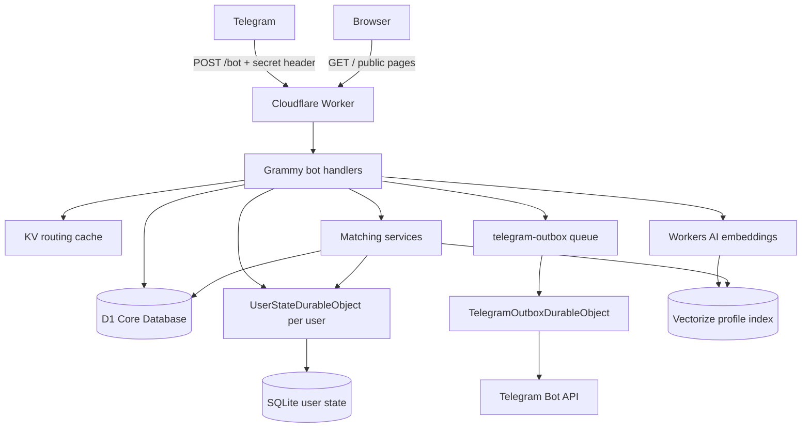
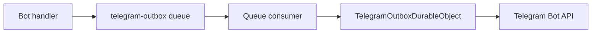

# Nekonymous

**Nekonymous** / **نِکونیموس** is a Persian-first anonymous messaging and anonymous matching bot for Telegram.

A user starts the bot, receives a personal Telegram deep link, and can receive anonymous messages through the bot without exposing their Telegram username. The same bot also includes a conversation-style assessment and an opt-in anonymous matching system: users can build a private matching profile, discover similar users, send an anonymous intro request, and start a conversation only after the other user accepts.

Nekonymous is designed as a small, honest, Cloudflare-native product:

- **Telegram** is the user interface.
- **Cloudflare Workers** run the bot webhook and public pages.
- **D1** stores relational source-of-truth records.
- **SQLite-backed Durable Objects** own hot per-user state and ticket coordination.
- **KV** is used only for routing/cache.
- **Cloudflare Queues** and an Outbox Durable Object handle non-critical Telegram sends safely.
- **Workers AI + Vectorize** power profile indexing and semantic candidate discovery.
- **Web Crypto** handles HMAC, HKDF, AES-GCM, and secure random identifiers.

The core design goal is simple:

> Minimize stored plaintext and user-visible identity leakage while keeping the relay, assessment, and matching flows fast, bounded, and operationally understandable.

---

## Product Scope

Nekonymous has three product surfaces.

### 1. Anonymous relay

1. A user starts the bot.
2. The bot creates a personal Telegram deep link.
3. Another person opens the link and writes a message.
4. The owner reads pending messages with `/inbox`.
5. The owner can reply anonymously, block/report the sender, pause new messages, or assign a private nickname.

### 2. Conversation-style assessment

The user can run a non-clinical assessment that describes their anonymous conversation style:

- boundary respect,
- emotional reactivity,
- social energy,
- warmth/cooperation,
- reliability,
- curiosity/depth,
- communication preferences.

The result is private to the user. It is stored as structured scores in D1 and as a controlled profile summary for Vectorize indexing.

### 3. Anonymous matching

A user can opt in to matching after completing the assessment.

The bot can find nearby candidates using Vectorize, re-score candidates deterministically, and let the user send an anonymous intro request. A match request does **not** open a conversation automatically. The candidate must accept first. If accepted, the intro becomes a normal anonymous inbox ticket.

Nekonymous is intentionally not:

- a full social network,
- a dating platform,
- a clinical or psychological diagnostic tool,
- an end-to-end encrypted messenger,
- a helpdesk,
- a heavy frontend app,
- a payment/wallet system.

---

## Bot Menu

The main menu is intentionally compact:

```text
[لینک من]
[🧭 مچ‌یابی]
[تنظیمات]
```

The **🧭 مچ‌یابی** group contains:

```text
[پروفایل من]
[پیدا کردن مچ]
[اجرای ارزیابی]
[بازگشت]
```

The settings page contains about/privacy/system options:

```text
[درباره]
[حریم خصوصی]
[توقف/شروع دریافت پیام]
[زبان]
[حذف حساب]
[بازگشت]
```

Direct command shortcuts may remain available:

```text
/start
/inbox
/assessment
/match
/settings
/language
```

---

## Privacy Model

Nekonymous is a **hosted anonymous relay**, not end-to-end encryption.

What the system protects:

- Senders and recipients do not see each other’s Telegram username through the bot UI.
- Raw Telegram user IDs are not used as public IDs, ticket refs, or callback refs.
- Telegram chat IDs are encrypted before storage.
- Message payloads are encrypted before storage.
- Message payloads are cleared after `/inbox` delivery.
- Only encrypted connection metadata remains for reply/block/report/nickname continuity.
- Match intro messages are encrypted at rest.
- Full assessment results are not shown to other users.
- Discoverability is off by default and must be explicitly enabled.
- Candidate matching never exposes Telegram username, public link, full assessment profile, or raw answers.

What the system does **not** claim:

- Telegram still receives the original messages because this is a Telegram bot.
- The Worker sees plaintext while processing a message before encrypting it at rest.
- Runtime secrets such as `APP_MASTER_KEY` and `APP_HMAC_PEPPER` are part of the trust boundary.
- A Cloudflare/operator account that can modify Worker code or access runtime secrets can compromise future messages.
- Matching similarity is approximate, not a guarantee.
- The assessment is not a diagnosis, therapy, or clinical assessment.

Recommended user-facing wording:

```text
این ارزیابی برای شناخت سبک گفت‌وگو و پیشنهادهای آینده طراحی شده است.
این ارزیابی تشخیص روان‌شناسی، درمان، یا ارزیابی پزشکی نیست.
```

---

## Architecture Overview



### Runtime layers

| Layer | Technology | Role |
|---|---|---|
| Edge entry | Cloudflare Worker | HTTP router, Telegram webhook, public pages |
| Bot framework | Grammy | Commands, messages, inline callbacks |
| Source of truth | Cloudflare D1 | Users, links, profiles, reports, match records |
| Hot user state | SQLite-backed Durable Object | Drafts, inbox tickets, blocks, labels, assessment sessions, rate limits |
| Routing cache | Cloudflare KV | `tg:{hash} -> userId`, `link:{slug} -> userId`, config/cache |
| Async delivery | Cloudflare Queue | Non-critical outbound Telegram jobs |
| Outbox coordination | Durable Object | Idempotent Telegram sends and future rate limits |
| Embeddings | Workers AI | Profile embedding generation |
| Vector search | Vectorize | Semantic candidate discovery |
| Crypto | Web Crypto API | HMAC, HKDF, AES-GCM, secure random IDs |

### Design principles

- Keep webhook handlers low-CPU and low-memory.
- Keep user-facing bot behavior stable.
- Use D1 for relational source-of-truth data.
- Use per-user Durable Objects when ordering, serialization, and strong coordination matter.
- Use KV only for read-heavy routing/cache.
- Use Queues for non-critical outbound sends.
- Treat all queue side effects as at-least-once and idempotent.
- Use Vectorize only for candidate discovery, not final decisions.
- Keep callback data short and opaque.
- Never put sensitive metadata into Telegram `callback_data`.
- Store sensitive payloads encrypted at rest.
- Clear message payloads after inbox delivery.
- Keep matching opt-in and consent-based.

---

## Storage Responsibility

| Data | Store | Reason |
|---|---|---|
| User identity | D1 | relational source of truth |
| Telegram user hash | D1 + KV cache | stable internal lookup |
| Encrypted Telegram chat id | D1 | needed for outbound sends |
| Public deep link slug | D1 + KV cache | source of truth + fast lookup |
| Conversation summary | D1 | timeline/index/counts only |
| Reports | D1 | moderation/audit index |
| Test attempts | D1 | attempt history |
| Test answers | D1 | scored answer history |
| Latest assessment profile | D1 | private user profile |
| Profile vector metadata | D1 + Vectorize | indexing state + candidate discovery |
| Match suggestions | D1 | callback-safe candidate references |
| Match requests | D1 | request lifecycle |
| Match intro ciphertext | D1 | encrypted request payload |
| Match blocks/events | D1 | safety and audit trail |
| Draft compose state | UserStateDO | hot mutable per-user state |
| Test session progress | UserStateDO | active progress and current index |
| Match intro draft | UserStateDO | active intro composition |
| Pause state | UserStateDO | checked in message hot path |
| Block list | UserStateDO | checked before accepting message/request |
| Private nicknames | UserStateDO | recipient-scoped private state |
| Pending inbox tickets | UserStateDO | ordered, bounded, per-recipient queue |
| Delivered ticket metadata | UserStateDO | reply/block/report/nickname continuity |
| Message payload ciphertext | UserStateDO | temporary encrypted payload |
| Processed events | UserStateDO / OutboxDO | idempotency |
| Outbound Telegram jobs | Queue + OutboxDO | async delivery and idempotency |
| Routing/config cache | KV | read-heavy cache only |

KV is not the authority for user state, conversations, message payloads, assessment state, match state, or profile state.

---

## HTTP Surface

| Method | Path | Auth | Purpose |
|---|---|---|---|
| `GET` | `/` | none | landing page |
| `GET` | `/about` | none | product/privacy explanation |
| `GET` | `/about/technical` | none | technical architecture guide |
| `POST` | `/bot` | `X-Telegram-Bot-Api-Secret-Token` = `BOT_SECRET_KEY` | Telegram webhook |

`POST /bot` must verify Telegram’s secret header before doing sensitive work.

---

## D1 Data Model

### Core tables

- `users`: internal user identity, Telegram hash, encrypted chat id, locale, status.
- `public_links`: public deep-link slug to internal owner user id.
- `conversations`: message timeline/index/counts only; no message body.
- `reports`: moderation/audit index with optional encrypted details.
- `consents`: privacy, matching, or future consent versions.

### Assessment/profile tables

- `assessment_attempts`: every assessment run.
- `assessment_answers`: scored answers by attempt.
- `assessment_profiles`: latest completed profile, deterministic scores, private result summary, controlled embedding text, vector status, discoverability, safety tier, intent, bucket.

### Matching tables

- `match_suggestions`: candidate suggestions shown to a user.
- `match_requests`: encrypted intro requests and lifecycle status.
- `match_blocks`: match-specific dismiss/block signals.
- `match_events`: compact audit/product events.

D1 must not store plaintext anonymous message bodies, plaintext match intros, raw Telegram IDs, or raw sensitive free-text profile data.

---

## UserState Durable Object

`UserStateDurableObject` is addressed by internal user id:

```ts
env.USER_STATE_DO.get(env.USER_STATE_DO.idFromName(userId))
```

It owns hot mutable state for one user.

### Tables

- `user_state`: runtime user state, locale, onboarding, pause status.
- `drafts`: active new message, reply, nickname, and match intro drafts.
- `inbox_tickets`: encrypted anonymous message tickets.
- `assessment_sessions`: active assessment progress and temporary answers.
- `blocks`: recipient-scoped blocked senders.
- `contact_labels`: private nicknames.
- `rate_limits`: per-user cooldowns/token buckets.
- `processed_events`: per-user idempotency keys.

---

## Ticketing Model

In Nekonymous, a ticket is:

> A recipient-scoped, encrypted, action-capable anonymous message reference.

Every accepted anonymous message creates one ticket inside the recipient’s `UserStateDO`.

```text
sender message
  -> encrypted payload
  -> encrypted connection metadata
  -> recipient UserStateDO inbox_tickets row
```

### Ticket identifiers

| Identifier | Purpose |
|---|---|
| `ticket_id` | internal cryptographic id, never exposed |
| `ref` | short opaque callback reference |
| `conversation_id` | D1 summary/index id |
| `dedupe_key` | prevents duplicate ticket creation |

Callback data stays short:

```text
r:{ref}   reply
b:{ref}   block
rp:{ref}  report
n:{ref}   nickname
```

Callback data is not trusted. The handler must resolve the `ref` inside the current user’s `UserStateDO` and verify ownership.

---

## Crypto Design

Nekonymous uses Web Crypto APIs in the Worker runtime.

### Secrets

| Secret | Purpose |
|---|---|
| `SECRET_TELEGRAM_API_TOKEN` | Telegram bot token |
| `BOT_SECRET_KEY` | Telegram webhook secret |
| `APP_MASTER_KEY` | encryption master key material |
| `APP_HMAC_PEPPER` | HMAC key for Telegram id hashing |

### Algorithms

| Operation | Algorithm |
|---|---|
| Telegram id hashing | HMAC-SHA-256 |
| Key derivation | HKDF-SHA-256 |
| Encryption | AES-256-GCM |
| IV | random 96-bit IV per encryption |
| Ticket ids | secure random bytes |
| Callback refs | short secure random opaque ids |

### Per-ticket key separation

For each accepted message, create a fresh `ticket_id`.

Use HKDF:

```text
IKM  = APP_MASTER_KEY
salt = ticket_id
```

Use different HKDF info labels:

| Purpose | HKDF info |
|---|---|
| payload encryption | `nekonymous:ticket:payload:v1` |
| connection metadata encryption | `nekonymous:ticket:connection:v1` |
| match intro encryption | `nekonymous:match:intro:v1` |
| sender alias derivation | `nekonymous:ticket:alias:v1` |

### Cipher envelope

Prefer a versioned envelope:

```json
{
  "v": 1,
  "kid": "k1",
  "iv": "base64url",
  "ct": "base64url"
}
```

Use AAD to bind ciphertext to context:

```text
purpose
ticket_id or request_id
sender_user_id
recipient_user_id
conversation_id or match_request_id
schema_version
```

---

## Anonymous Message Lifecycle

### `/start`

1. Verify Telegram webhook secret.
2. Resolve Telegram user.
3. Compute `telegram_user_hash`.
4. Check KV cache `tg:{hash}`.
5. Fallback to D1 `users`.
6. If missing, create internal user id.
7. Encrypt Telegram chat id.
8. Insert D1 `users`.
9. Create public link slug.
10. Insert D1 `public_links`.
11. Cache `tg:{hash} -> userId`.
12. Cache `link:{slug} -> userId`.
13. Initialize `UserStateDO`.
14. Show language picker if onboarding is incomplete.
15. Otherwise show personal link.

### `/start {slug}`

1. Resolve slug from KV.
2. Fallback to D1 `public_links`.
3. Reject missing/inactive link.
4. Reject self-message.
5. Ask recipient `UserStateDO` if sender can send.
6. Store sender draft.
7. Send compose prompt.

### Sending a message

1. Resolve sender.
2. Load sender draft from `UserStateDO`.
3. Check sender rate limit.
4. Check recipient pause/block state.
5. Reject unsupported payload types.
6. Create ticket/ref/conversation/dedupe ids.
7. Build message payload.
8. Build connection metadata.
9. Encrypt payload and connection metadata separately.
10. Insert ticket into recipient `UserStateDO`.
11. Clear sender draft.
12. Upsert D1 conversation summary.
13. Confirm to sender.
14. Queue recipient notification.

### `/inbox`

1. Resolve recipient.
2. Load pending inbox tickets from `UserStateDO`.
3. Decrypt payloads.
4. Render messages in recipient locale.
5. Send messages to Telegram with inline actions.
6. Mark tickets delivered.
7. Clear `payload_ciphertext`.
8. Keep encrypted connection metadata.

---

## Test and Profile Indexing

The assessment system builds a private conversation profile.

```text
User opens 🧭 مچ‌یابی
  -> اجرای ارزیابی
  -> answer Likert questions
  -> active progress in UserStateDO
  -> completed attempt + answers in D1
  -> deterministic scores
  -> private result summary
  -> controlled profile summary
  -> Workers AI embedding
  -> Vectorize upsert
```

### Scoring dimensions

Core dimensions:

- boundary respect,
- emotional reactivity,
- social energy,
- warmth/cooperation,
- reliability,
- curiosity/depth.

Communication dimensions:

- depth preference,
- reply pace,
- directness,
- conflict reflectiveness,
- support need,
- anonymity comfort.

Scores are deterministic and normalized to 0..100.

### Embedding policy

Only a controlled `profile_summary_text` is embedded.

It must not include:

- raw answers,
- Telegram IDs,
- anonymous messages,
- private nicknames,
- report/block data,
- clinical labels.

Vector ID format:

```text
profile:{userId}:{profileVersion}
```

Default discoverability:

```text
discoverable = false
```

The user must opt in before appearing in matching search.

---

## Vectorize and Workers AI

Vectorize stores completed profile embeddings for semantic candidate discovery.

Recommended metadata:

```ts
type ProfileVectorMetadata = {
  userId: string
  locale: 'fa' | 'en'
  discoverable: boolean
  safetyTier: 'normal' | 'limited'
  profileVersion: string
  intentPrimary: string
  profileBucket: number
}
```

Recommended metadata indexes:

```text
locale
discoverable
safetyTier
profileVersion
intentPrimary
profileBucket
```

Matching query pattern:

```text
Requester profile vector
  -> Vectorize topK candidates
  -> metadata filter: discoverable=true, locale, safetyTier=normal, profileVersion
  -> D1 candidate profile fetch
  -> hard filters
  -> deterministic scoring
  -> top 5 suggestions
```

Vectorize is not the final decision maker. It only narrows the candidate set.

---

## Anonymous Matching

Matching is opt-in and double-confirmed.

```text
User opens 🧭 مچ‌یابی
  -> پیدا کردن مچ
  -> eligibility checks
  -> opt-in discoverability if needed
  -> Vectorize candidate search
  -> deterministic scoring
  -> show up to 5 anonymous suggestions
  -> user selects one suggestion
  -> user writes intro
  -> encrypted match_request created
  -> candidate receives request
  -> candidate accepts or declines
```

### Candidate suggestion

The requester sees anonymous suggestions such as:

```text
۱) شباهت تقریبی: ۸۶٪
سبک پیشنهادی: گفت‌وگوی آرام و عمیق

چرا؟
- شباهت خوبی در عمق گفت‌وگو دیده می‌شود.
- هر دو گفت‌وگوی کم‌فشار و محترمانه را ترجیح می‌دهید.
```

No identity is shown.

### Match request

The candidate receives:

```text
🔎 درخواست گفت‌وگوی ناشناس

یک نفر با حدود ۸۶٪ شباهت در سبک گفت‌وگو می‌خواهد با تو یک گفت‌وگوی ناشناس شروع کند.

پیام شروع:
«...»

اگر قبول کنی، این پیام وارد صندوق ناشناس تو می‌شود و می‌توانی جواب بدهی.
```

The candidate can accept or decline.

### Accept

If accepted:

1. Verify candidate owns the request.
2. Verify request is pending and not expired.
3. Decrypt intro.
4. Create a normal anonymous inbox ticket from requester to candidate.
5. Mark request accepted.
6. Notify requester.
7. Candidate uses `/inbox` and normal reply flow.

### Decline

If declined:

1. Verify candidate owns the request.
2. Mark request declined.
3. Notify requester with a low-pressure message.
4. No inbox ticket is created.

### Safety rules

Hard filters remove:

- self,
- non-discoverable users,
- inactive users,
- missing profiles,
- missing vectors,
- blocked relationships,
- active pending duplicate requests,
- recent declined/dismissed pairs,
- safety-tier blocked users.

---

## Outbox Queue

Immediate command responses can be sent directly.

Non-critical sends go through `telegram-outbox`:

- recipient pending notifications,
- match request notifications,
- accept/decline notifications,
- future reminders.



### `TelegramOutboxJob`

```ts
export type TelegramOutboxJob = {
  idempotencyKey: string
  chatCiphertext: string
  chatHash: string
  method: 'sendMessage' | 'editMessageText' | 'answerCallbackQuery'
  payload: {
    text?: string
    parse_mode?: 'HTML'
    reply_markup?: unknown
    callback_query_id?: string
  }
  priority: 'normal' | 'low'
  createdAt: number
}
```

The outbox must check `idempotencyKey` before sending to Telegram.

---

## Multilingual Behavior

Nekonymous is Persian-first and locale-aware.

Rules:

- First `/start` can show a language picker.
- Store locale in D1 and `UserStateDO`.
- Telegram `language_code` is a suggestion, not final truth.
- User-generated messages are not automatically translated.
- Bot wrappers/buttons/errors/settings/inbox labels/assessment/match cards render in the recipient’s locale.
- `/language` lets users change locale.

---

## Security and Performance Notes

### Strong points

- KV does not own hot mutable state.
- Message payloads are not KV blobs.
- Inboxes and callbacks are coordinated by recipient-scoped `UserStateDO`.
- Payload and connection metadata are encrypted separately.
- Payloads are cleared after delivery.
- Callback ownership is verified against the current user’s state object.
- Queue sends are idempotent.
- Matching is opt-in.
- Candidate requests require accept before conversation.
- D1 stores summaries and indexes, not plaintext message bodies.
- Vectorize stores controlled profile embeddings, not raw answers/messages.

### Tradeoffs

- This is hosted relay privacy, not E2EE.
- Telegram and Worker see plaintext during processing.
- Runtime secrets are part of the trust boundary.
- Delivered tickets keep encrypted connection metadata for a limited time.
- Reports do not include message text by default.
- Queue delivery is at-least-once; idempotency is required.
- Vector search gives approximate candidates; final scoring and filters happen in code.

---

## Suggested Project Map

Exact filenames can differ, but responsibilities should stay close to this:

```text
src/
├── index.ts
├── types.ts
├── bot/
│   ├── bot.ts
│   ├── commands.ts
│   ├── actions.ts
│   ├── settings.ts
│   ├── language.ts
│   ├── test.ts
│   └── matching.ts
├── features/
│   ├── test/
│   │   ├── question-bank.ts
│   │   ├── scoring.ts
│   │   ├── profile-summary.ts
│   │   ├── profile-vector-service.ts
│   │   ├── test-profile-service.ts
│   │   └── constants.ts
│   └── matching/
│       ├── match-service.ts
│       ├── match-scoring.ts
│       ├── match-request-service.ts
│       ├── match-vector-service.ts
│       ├── match-copy.ts
│       └── match-types.ts
├── services/
│   ├── identity-service.ts
│   ├── user-state-service.ts
│   ├── message-service.ts
│   ├── outbox-service.ts
│   ├── conversation-summary-service.ts
│   ├── report-service.ts
│   ├── crypto-service.ts
│   └── locale-service.ts
├── storage/
│   ├── d1/
│   │   ├── users.ts
│   │   ├── links.ts
│   │   ├── conversations.ts
│   │   ├── reports.ts
│   │   ├── test-profiles.ts
│   │   └── matching.ts
│   └── durable/
│       ├── user-state-do.ts
│       └── telegram-outbox-do.ts
├── queues/
│   ├── types.ts
│   └── telegram-outbox.consumer.ts
├── front/
│   ├── layout.ts
│   ├── home.ts
│   ├── about.ts
│   └── technical.ts
├── i18n/
│   └── locales/
│       ├── fa.ftl
│       └── en.ftl
└── utils/
    ├── payload.ts
    ├── sender.ts
    ├── worker.ts
    ├── tools.ts
    ├── constant.ts
    └── messages*.ts

migrations/
├── 0001_core.sql
├── 0002_assessment_profiles_and_vectors.sql
└── 0003_matching.sql
```

---

## Local Setup

### Requirements

- Node.js 22+
- pnpm
- Cloudflare account with Workers, D1, KV, Durable Objects, Queues, Workers AI, and Vectorize enabled
- Telegram bot token from BotFather

### Install

```bash
pnpm install
```

### Runtime secrets

Local development uses `.dev.vars`. Production uses Wrangler secrets.

| Variable | Purpose |
|---|---|
| `SECRET_TELEGRAM_API_TOKEN` | Telegram bot token |
| `BOT_SECRET_KEY` | Telegram webhook secret token |
| `APP_MASTER_KEY` | encryption master key material |
| `APP_HMAC_PEPPER` | HMAC key for Telegram id hashing |
| `BOT_INFO` | JSON compatible with Grammy `botInfo` |
| `BOT_NAME` | public display name |
| `BOT_USERNAME` | Telegram bot username without `@` |
| `PUBLIC_SITE_URL` | public Worker origin |
| `PRODUCTION_WEBHOOK_URL` | Telegram webhook URL |

Production setup:

```bash
wrangler secret put SECRET_TELEGRAM_API_TOKEN
wrangler secret put BOT_SECRET_KEY
wrangler secret put APP_MASTER_KEY
wrangler secret put APP_HMAC_PEPPER
wrangler secret put BOT_USERNAME
```

Never commit real `.env`, `.dev.vars`, Telegram tokens, or runtime secrets.

---

## Wrangler Bindings

Example shape:

```toml
name = "nekonymous"
main = "src/index.ts"
compatibility_date = "2026-06-16"

[vars]
PUBLIC_SITE_URL = "https://nekonymous.mohetios.dev"

[[kv_namespaces]]
binding = "NEKO_KV"
id = "YOUR_KV_NAMESPACE_ID"

[[d1_databases]]
binding = "DB"
database_name = "nekonymous_core"
database_id = "YOUR_D1_DATABASE_ID"

[[queues.producers]]
binding = "TELEGRAM_OUTBOX_QUEUE"
queue = "telegram-outbox"

[[queues.consumers]]
queue = "telegram-outbox"
max_batch_size = 25
max_batch_timeout = 2
max_retries = 5
dead_letter_queue = "dead-letter"

[durable_objects]
bindings = [
  { name = "USER_STATE_DO", class_name = "UserStateDurableObject" },
  { name = "TELEGRAM_OUTBOX_DO", class_name = "TelegramOutboxDurableObject" }
]

[ai]
binding = "AI"

[[vectorize]]
binding = "PROFILE_VECTORS"
index_name = "nekonymous-profile-vectors"

[[migrations]]
tag = "v1-clean-core"
new_sqlite_classes = [
  "UserStateDurableObject",
  "TelegramOutboxDurableObject"
]
```

---

## Fresh Cloudflare Setup

Create D1:

```bash
wrangler d1 create nekonymous_core
```

Apply migrations locally:

```bash
pnpm db:migrations:apply:local
```

Apply migrations remotely (`pnpm deploy` also runs remote migrations before deploy):

```bash
pnpm db:migrations:apply:remote
```

Create queues:

```bash
wrangler queues create telegram-outbox
wrangler queues create dead-letter
```

Create KV:

```bash
wrangler kv namespace create NEKO_KV
```

Create Vectorize index:

```bash
wrangler vectorize create nekonymous-profile-vectors --dimensions=768 --metric=cosine
```

Create metadata indexes:

```bash
wrangler vectorize create-metadata-index nekonymous-profile-vectors --propertyName=locale --type=string
wrangler vectorize create-metadata-index nekonymous-profile-vectors --propertyName=discoverable --type=boolean
wrangler vectorize create-metadata-index nekonymous-profile-vectors --propertyName=safetyTier --type=string
wrangler vectorize create-metadata-index nekonymous-profile-vectors --propertyName=profileVersion --type=string
wrangler vectorize create-metadata-index nekonymous-profile-vectors --propertyName=intentPrimary --type=string
wrangler vectorize create-metadata-index nekonymous-profile-vectors --propertyName=profileBucket --type=number
```

Set `PROFILE_EMBEDDING_MODEL` in code/config to the selected Workers AI embedding model and keep `MODEL_DIMENSIONS` aligned with that model.

---

## Telegram Webhook

Set webhook:

```bash
curl -X POST "https://api.telegram.org/bot<TOKEN>/setWebhook" \
  -H "Content-Type: application/json" \
  -d '{
    "url": "https://nekonymous.mohetios.dev/bot",
    "secret_token": "<BOT_SECRET_KEY>",
    "allowed_updates": ["message", "callback_query"],
    "max_connections": 80
  }'
```

---

## Commands

Use actual package scripts if they differ.

```bash
pnpm dev
pnpm typecheck
pnpm lint
pnpm knip
pnpm test
pnpm test:crypto
pnpm check
pnpm deploy
```

Cloudflare checks:

```bash
wrangler types
wrangler deploy --dry-run
```

---

## Operational Checklist

Before deploying a bot, crypto, storage, assessment, vector, or matching change:

- `pnpm check` passes.
- `/bot` validates Telegram webhook secret before sensitive work.
- No plaintext message bodies are stored in D1, KV, DO, Vectorize metadata, or logs.
- No plaintext intro messages are stored in D1.
- No logs include ticket IDs, decrypted payloads, intros, raw answers, Telegram tokens, or runtime secrets.
- Message accept path checks pause/block/rate-limit before inserting a ticket.
- `/inbox` clears `payload_ciphertext` after delivery.
- Callback handlers verify ownership.
- Queue consumers are idempotent.
- Outbox duplicate jobs do not duplicate Telegram sends.
- KV only stores routing/cache records.
- D1 contains no message body plaintext.
- Durable Object queries are bounded.
- Vectorize metadata indexes exist before relying on metadata filters.
- Vectorize indexing failure is non-fatal for assessment completion.
- Matching requires explicit discoverability opt-in.
- Match request accept/decline is idempotent.
- Match requests do not create conversations before accept.

---

## Production Test Checklist

Use at least three Telegram accounts in staging:

- User A: requester,
- User B: candidate,
- User C: non-discoverable or blocked candidate.

### Anonymous relay

1. Fresh `/start`.
2. Language selection.
3. Personal link creation.
4. Open `/start {slug}` from another account.
5. Compose anonymous message.
6. Receiver `/inbox`.
7. Receiver replies.
8. Original sender reads reply.
9. Receiver blocks sender.
10. Blocked sender cannot send again.
11. Pause/resume works.
12. Nickname works.
13. Report works.
14. Duplicate update does not create duplicate ticket.
15. Duplicate outbox job does not send duplicate Telegram message.

### Test/profile/vector

1. A completes assessment.
2. B completes assessment.
3. C completes assessment.
4. Result persists in D1.
5. `assessment_profiles.profile_summary_text` contains no raw answers.
6. Vectorize upsert succeeds.
7. Vector IDs are deterministic.
8. `discoverable` remains false by default.
9. No assessment state is written to KV.
10. `🧭 مچ‌یابی → پروفایل من` shows private profile.

### Matching

1. A opens `🧭 مچ‌یابی`.
2. A enables discoverability.
3. B enables discoverability.
4. C remains non-discoverable.
5. A finds matches.
6. B can appear.
7. C cannot appear.
8. A never appears in own results.
9. A selects B.
10. A writes intro.
11. D1 `match_requests` row exists.
12. Intro is encrypted.
13. B receives request.
14. B accepts.
15. Intro appears as a normal anonymous inbox ticket.
16. B replies.
17. A receives reply.
18. Duplicate accept does not create duplicate ticket.
19. Decline flow creates no inbox ticket.
20. Expired request cannot be accepted.

---

## Roadmap

Current V1 includes:

- anonymous relay,
- secure ticketing core,
- assessment/profile system,
- Workers AI embedding,
- Vectorize profile index,
- opt-in anonymous matching,
- double-confirmed match requests.

Possible future work:

1. Telegram Stars credit packages for paid/high-volume matching.
2. Admin/moderation console.
3. Better report review tooling.
4. Self-hosting guide.
5. Public technical article.
6. More languages.
7. Safer abuse heuristics.
8. Optional AI-generated match explanations, only after deterministic filters.