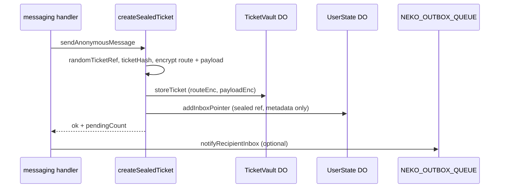
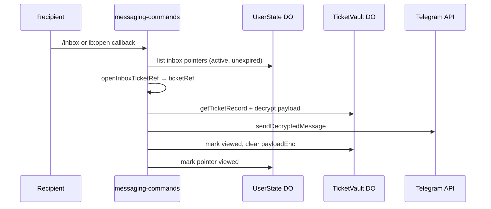

# Anonymous messaging (V1)

How sealed tickets, the ticket vault, and inbox pointers work together. For privacy constraints see [threat-model.md](../security/threat-model.md).

## Components

| Piece | Location | Role |
|-------|----------|------|
| Seal + send | `features/messaging/create-sealed-ticket.ts` | Encrypt route/payload, store vault record, add inbox pointer |
| Inbox pointer helpers | `features/messaging/inbox-pointer.ts` | Retention, display numbers, seal/open callback ref |
| Ticket vault DO | `storage/ticket-vault/` | Encrypted route + payload ciphertext per ticket hash |
| User state DO | `storage/user-state-do.ts` | Per-recipient inbox pointer list (no plaintext bodies) |
| Callback routing | `utils/telegram-callbacks.ts` | Build/validate `o:`, `r:`, `b:`, … callback_data |
| Action resolution | `features/messaging/resolve-ticket-action.ts` | Load vault record, verify owner proof, decrypt route |
| Webhook idempotency | `storage/user-state-do.ts` + `bot/router.ts` | Two-phase update claim (`processing` lease → `done`) |

D1 stores **no message bodies** and **no sender–recipient edges** for anonymous relay. `platform_stats.messages_relayed` is the only anonymous counter increment on accept.

## Send flow

Steps in code:

1. **`randomTicketRef()`** — 32-char callback ref (never stored raw in D1/KV).
2. **`createTicketHash`** — HMAC lookup key from ref + pepper.
3. **`ownerProofTag`** — binds vault record to recipient’s telegram hash.
4. **`RouteCapsule`** — encrypted routing tags, pair tag, report seeds, reply policy (no plaintext Telegram ids in D1).
5. **`PayloadCapsule`** — encrypted message/media ids.
6. **`sealInboxTicketRef`** — encrypts callback ref into the inbox pointer row.
7. **`storeTicket`** then **`addInboxPointer`** — if pointer insert fails, vault row is cleaned up.
8. **Outbox event key** — recipient notification dedupe key is per message event (`outbox:message-created:{ticketHash}`), not per recipient/count.

## Inbox delivery

After delivery, **payload ciphertext is cleared** from the vault. `connection`/route material stays for reply, block, and report actions.

## Inline actions (reply / block / report)

Callback buttons use prefixes from `INBOX_CALLBACK` in `utils/telegram-callbacks.ts` (e.g. `o:{ref}`, `r:{ref}`).

1. Grammy routes regex in `bot/register-handlers.ts`.
2. Handler calls **`resolveTicketAction`** with the action name.
3. Resolver loads vault row by hash, verifies **owner proof**, decrypts **route**.
4. Handler performs block/report/reply draft using route tags — not callback data alone.

## Status fields

Lifecycle unions live in `src/status.ts`:

- **`InboxPointerStatus`** — UserState `inbox_pointers.status`
- **`TicketVaultStatus`** — vault record status (`ticket-vault.types.ts`)

Pointers and vault rows move through `active` → `viewed` / `replied` / `blocked` / `reported`; vault may also become `expired`.

## Limits

- Inbox cap: **50** active pointers per UserState DO
- Retention: **30 days** (`INBOX_RETENTION_DAYS` in `inbox-pointer.ts`)
- Telegram `callback_data`: **64 bytes** (enforced in `encodeInboxCallbackData`)

## Webhook idempotency

- Webhook events are keyed by Telegram `update_id`.
- Claim is two-phase:
  - `processing` with lease (`lease_until`)
  - `done` after successful critical processing
- Duplicate `done` updates are skipped safely.
- Active `processing` lease prevents side-effect replay.
- Expired `processing` lease is recoverable by a new claim.

## Related docs

- [ticketing crypto](./crypto.md) — `src/ticketing/` module map
- [onboarding.md](../onboarding.md) — where to wire new commands/callbacks
- [AGENTS.md](../../AGENTS.md) — full bot architecture rules
