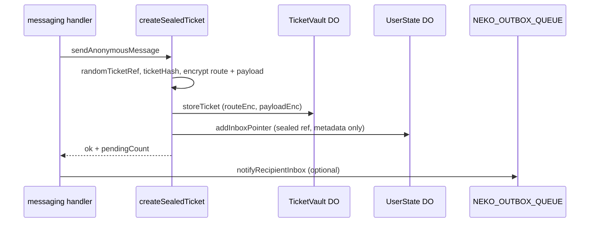
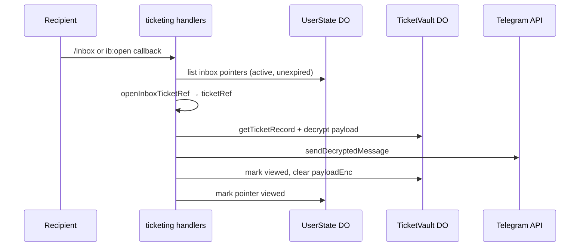

# Sealed Ticket Routing and Inbox (V1)

**Status:** current architecture reference — implemented in V1 release candidate.

How sealed tickets, the ticket vault, and inbox pointers work together. For privacy limits see [threat-model.md](../security/threat-model.md).

## Implementation status

| Behavior | V1 status |
|----------|-----------|
| Raw `ticketRef` stored in D1/KV | **Not stored** — lookup via HMAC hash; inbox pointer holds sealed ref |
| Anonymous message bodies in D1 | **Not stored** |
| Sender–recipient graph in D1 for relay | **Not stored** |
| Route capsule encrypted at rest | **Implemented** (`TicketVaultDO`) |
| Payload ciphertext temporary | **Implemented** — cleared after successful inbox delivery |
| Inbox retention 30 days | **Implemented** (`INBOX_RETENTION_DAYS` in `inbox-pointer.ts`) |
| Callback actions after view | **Implemented** — route material kept until expiry for reply/block/report/nickname |
| Aggregate relay counter in D1 | **Implemented** (`message_created` via `neko-stats`; see [platform-stats-engine.md](./platform-stats-engine.md)) |

## Components

| Piece | Location | Role |
|-------|----------|------|
| Seal + send | `features/ticketing/create-sealed-ticket.ts` | Encrypt route/payload, store vault record, add inbox pointer |
| Inbox pointer helpers | `features/ticketing/inbox-pointer.ts` | Retention, display numbers, seal/open callback ref |
| Ticket vault DO | `storage/ticket-vault/` | Encrypted route + payload ciphertext per ticket hash |
| User state DO | `storage/user-state-do.ts` | Per-recipient inbox pointer list (no plaintext bodies) |
| Callback routing | `bot/callback-data.ts` | Build/validate inbox `callback_data` |
| Action resolution | `features/ticketing/resolve-ticket-action.ts` | Load vault record, verify owner proof, decrypt route |
| Webhook idempotency | `storage/user-state-do.ts` + `bot/webhook.ts` | Two-phase update claim (`processing` lease → `done`) |

## Send flow

Steps in code:

1. **`randomTicketRef()`** — 32-char callback ref (never stored raw in D1/KV).
2. **`createTicketHash`** — HMAC lookup key from ref + pepper.
3. **`ownerProofTag`** — binds vault record to recipient’s telegram hash.
4. **`RouteCapsule`** — encrypted routing tags, pair tag, report seeds, reply policy (no plaintext Telegram ids in D1).
5. **`PayloadCapsule`** — encrypted message/media ids.
6. **`sealInboxTicketRef`** — encrypts callback ref into the inbox pointer row.
7. **`storeTicket`** then **`addInboxPointer`** — if pointer insert fails, vault row is cleaned up.
8. **Outbox event key** — recipient notification dedupe key is per message event (`outbox:message-created:{ticketHash}`).

## Inbox delivery

After delivery, **payload ciphertext is cleared** from the vault. Route material stays for reply, block, and report actions until expiry.

`/inbox` decrypts at most **10** payloads per request (`features/ticketing/inbox.ts`).

## Inline actions (reply / block / report / nickname)

Active inbox callbacks: `r:{ref}`, `b:{ref}`, `u:{ref}`, `n:{ref}`, `rp:{ref}` — built from `INBOX_CALLBACK` in `bot/callback-data.ts`.

1. Grammy routes regex in `bot/register-handlers.ts`.
2. Handler calls **`resolveTicketAction`** with the action name.
3. Resolver loads vault row by hash, verifies **owner proof**, decrypts **route**.
4. Handler performs block/report/reply draft using route tags — not callback data alone.

Callbacks expire when the underlying ticket/route expires.

## Crypto primitives

All ticketing crypto lives under **`src/features/ticketing/`** (Web Crypto only). Secrets: `APP_MASTER_KEY`, `APP_HMAC_PEPPER`.

| Module | Role |
|--------|------|
| `keys.ts` | Ticket ref/hash, pair tags, owner proof, HKDF-derived ticket keys |
| `envelope.ts` | Wire `{ v, kid, iv, ct }` with optional AAD |
| `ticketing-service.ts` | Chat-id sealing, block HMACs, match intro encryption |
| `service.ts` / `inbox.ts` / `actions.ts` / `handlers.ts` | Sealed message send, inbox delivery, and ticket callbacks |

Do not log ticket refs, secrets, decrypted payloads, or raw Telegram tokens.

## Status fields

Lifecycle unions live in `src/status.ts`:

- **`InboxPointerStatus`** — UserState `inbox_pointers.status`
- **`TicketVaultStatus`** — vault record status (`ticket-vault.types.ts`)

Pointers and vault rows move through `active` → `viewed` / `replied` / `blocked` / `reported`; vault may also become `expired`.

## Limits

- Inbox cap: **50** active pointers per UserState DO
- Retention: **30 days** (`INBOX_RETENTION_DAYS`)
- Telegram `callback_data`: **64 bytes** (enforced in `encodeInboxCallbackData`)
- Global user-action throttle: **1 second** (`user-rate-limit.ts`)

## Webhook idempotency

- Webhook events are keyed by Telegram `update_id`.
- Claim is two-phase: `processing` with lease → `done` after success.
- Duplicate `done` updates are skipped; expired `processing` leases are recoverable.

## Future improvements (not V1)

- Stricter retention policies for viewed ticket shells
- Additional outbox shaping beyond schema reservation

## Related docs

- [threat-model.md](../security/threat-model.md) — privacy boundaries and D1 leak scenarios
- [conversation-suggestions-v2.md](./conversation-suggestions-v2.md) — conversation suggestions integration
- [AGENTS.md](../../AGENTS.md) — maintainer bot architecture rules
