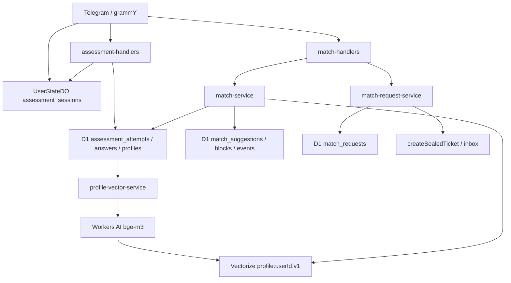

# Conversation Suggestions V2 — Phase 0 Source Audit

**Date:** 2026-07-11  
**Scope:** Read-only inventory of V1 assessment and matching before clean-slate V2 refactor.  
**Behavior:** No code changes in this phase.

---

## Executive summary

V1 couples **conversation profile**, **vector discovery**, and **suggestion/request workflow** to **D1 relational rows** (`assessment_*`, `match_*`) and a **single 1024-dimensional Workers AI embedding** per user (`profile:{userId}:v1`). That directly contradicts V2 invariants (no user graph in D1, no profile-to-user linkage in Vectorize, sealed capability chain).

**Preserved systems** (out of refactor scope): Telegram identity/routing, sealed-ticket messaging, inbox/reply/block/report, Telegram outbox queue, aggregate stats (`platform_daily_*`), settings unrelated to match history.

**Baseline checks:**

| Command | Result |
|---------|--------|
| `pnpm check` | **PASS** (typecheck, lint, knip, all tests, audit:ticket-storage) |
| `pnpm audit:d1:local` (before migrations) | **FAIL** — `no such table: d1_migrations` |
| `pnpm db:migrations:apply:local` then `pnpm audit:d1:local` | **PASS** — `AUDIT RESULT: OK` |

---

## 1. V1 assessment files

| File | Role |
|------|------|
| `src/features/assessment/constants.ts` | Workers AI model (`@cf/baai/bge-m3`), 1024 dims, `t:` callback tokens |
| `src/features/assessment/question-bank.ts` | 56 questions, 14 dimensions × 4, version `v1`, Persian question text |
| `src/features/assessment/scoring.ts` | Normalization, `computeProfileQuality`, `computeSafetyTier`, `computePrimaryIntent`, result summary |
| `src/features/assessment/assessment-scores.ts` | JSON serialize/parse dimension scores, percent formatting |
| `src/features/assessment/profile-summary.ts` | Controlled FA/EN summary text for embedding and display |
| `src/features/assessment/assessment-profile-service.ts` | D1 CRUD: attempts, answers, profiles; discoverability; safety tier |
| `src/features/assessment/profile-vector-service.ts` | Workers AI embed → Vectorize upsert; `profile:{userId}:v1`; index events in D1 |
| `src/features/assessment/assessment-flow-service.ts` | Session orchestration (UserStateDO + D1 attempt) |
| `src/features/assessment/assessment-handlers.ts` | `/assessment`, `t:` callbacks, dashboard, question flow, completion |
| `src/features/assessment/keyboards.ts` | Inline keyboards for assessment UI |

### 1.1 V1 assessment dimensions (14)

`boundaryRespect`, `honestyTransparency`, `emotionalSensitivity`, `emotionalRegulation`, `socialEnergy`, `warmthEmpathy`, `reliabilityConsistency`, `curiosityDepth`, `depthPreference`, `replyPacePreference`, `directnessPreference`, `conflictRepair`, `supportPreference`, `anonymityComfort`

### 1.2 V1 assessment question model

- **Count:** 56 (`ASSESSMENT_QUESTION_COUNT` in `assessment-ui.ts`, `EXPECTED_QUESTIONS_PER_DIMENSION = 4`)
- **Scale:** Likert 1–5 only (no “no preference” on desired-style)
- **Reverse-worded items:** supported via `reverse?: boolean` on questions (V2 forbids)
- **Version constant:** `ASSESSMENT_VERSION = "v1"`

---

## 2. V1 matching files

| File | Role |
|------|------|
| `src/features/matching/constants.ts` | `m:` callbacks, limits (topK=30, 5 results, TTLs, rate limits) |
| `src/features/matching/match-types.ts` | Row DTOs, `MatchCandidate`, dashboard/hub types |
| `src/features/matching/match-scoring.ts` | Deterministic 14-dimension scoring, explanations, quality labels |
| `src/features/matching/match-selection.ts` | Merge vector + D1 candidates, rank pool |
| `src/features/matching/match-vector-service.ts` | Vectorize query + `getByIds`; metadata filters |
| `src/features/matching/match-service.ts` | Search, suggestions CRUD, blocks, discoverability, D1 fallback |
| `src/features/matching/match-request-service.ts` | Request lifecycle, intro encryption, accept → sealed ticket |
| `src/features/matching/match-quality.ts` | Quality label mapping from i18n |
| `src/features/matching/match-handlers.ts` | `/match`, `m:` callbacks, intro draft (`match_intro`) |
| `src/features/matching/suggestion-hub.ts` | Hub render (shared by `/match`, menu, assessment) |
| `src/features/matching/match-profile-screen.ts` | Profile screen command/callback |
| `src/features/matching/match-profile-view.ts` | Profile message formatting from D1 row |
| `src/features/matching/keyboards.ts` | Hub, results, request action inline keyboards |

---

## 3. Import dependency surface

### 3.1 External importers of `src/features/assessment/**`

| Importer | Imports |
|----------|---------|
| `src/bot/register-handlers.ts` | `handleAssessmentCallback`, `handleAssessmentCommand` |
| `src/features/matching/match-handlers.ts` | `getLatestAssessmentProfile`, `isCurrentAssessmentVersion`, `sendAssessmentDashboard` |
| `src/features/matching/match-service.ts` | `getMatchProfile`, `isMatchEligibleProfile`, `setDiscoverable`, `AssessmentProfileRow`, `ASSESSMENT_VERSION` |
| `src/features/matching/match-selection.ts` | `AssessmentProfileRow` |
| `src/features/matching/match-scoring.ts` | profile row types, scores, dimensions, `clamp01` |
| `src/features/matching/match-vector-service.ts` | `buildProfileVectorId`, `AssessmentProfileRow`, `ASSESSMENT_VERSION` |
| `src/features/matching/match-profile-screen.ts` | `getLatestAssessmentProfile` |
| `src/features/matching/match-profile-view.ts` | profile row, scores, labels, dimensions |
| `src/features/matching/suggestion-hub.ts` | `getLatestAssessmentProfile` |
| `src/features/assessment/*` (internal) | cross-imports within feature |
| `tools/verify-assessment.ts` | `question-bank.ts` types/constants |

### 3.2 External importers of `src/features/matching/**`

| Importer | Imports |
|----------|---------|
| `src/bot/register-handlers.ts` | `handleMatchCallback`, `handleMatchCommand`, `matchCallbackQueryRegex` |
| `src/bot/menu.ts` | `renderSuggestionHub` (reply keyboard «پیشنهاد گفت‌وگو») |
| `src/features/messaging/messaging-commands.ts` | `handleMatchIntroInput` (draft mode `match_intro`) |
| `src/features/settings/settings-handlers.ts` | `resetMatchHistoryForUser` helpers from `match-service` |
| `src/features/assessment/assessment-handlers.ts` | `renderSuggestionHub` (back-to-hub) |
| `tools/verify-bot-flow.ts` | `matchCallbackQueryRegex`, source scans |
| `tools/verify-matching.ts` | (standalone copy of scoring weights; no runtime import) |

### 3.3 Storage / identity touchpoints

| Module | Assessment/matching usage |
|--------|---------------------------|
| `src/storage/user-state-do.ts` | `assessment_sessions` table; HTTP `/assessment/*` routes |
| `src/storage/user-state-client.ts` | `startAssessmentSession`, `getAssessmentSession`, `saveAssessmentAnswer`, etc. |
| `src/features/identity/identity-service.ts` | `hardDeleteUserAccount` deletes all assessment/match D1 rows + Vectorize vector |
| `src/types.ts` | `UserDraftMode` includes `"match_intro"`; `pendingSettings` includes `confirmResetMatchHistory` |

### 3.4 Crypto reuse (V2 foundation)

No `src/crypto/` tree. Shared primitives live in `src/features/ticketing/`:

`base64url.ts`, `hmac.ts`, `hkdf.ts`, `aes-gcm.ts`, `envelope.ts`, `keys.ts`, `ticketing-service.ts`

Matching already uses `createPairTag`, `createReportTag`, `generateOpaqueId` from ticketing for reports/blocks — V2 will extend this pattern.

---

## 4. Bot commands and callbacks

### 4.1 Registered commands (`src/bot/commands.ts`)

| Command | Handler | Notes |
|---------|---------|-------|
| `/assessment` | `assessment-handlers.handleAssessmentCommand` | Assessment dashboard |
| `/match` | `match-handlers.handleMatchCommand` | Suggestion hub |

**Not registered (removed):** `/match_system` — verified absent from `BOT_COMMANDS` and `register-handlers`; unknown commands get `UNKNOWN_COMMAND_MESSAGE`.

### 4.2 Callback prefixes (`src/bot/register-handlers.ts`)

| Prefix | Handler | Purpose |
|--------|---------|---------|
| `t:` | `handleAssessmentCallback` | Assessment flow |
| `m:` | `handleMatchCallback` | Suggestion hub (regex in `constants.ts`) |
| `s:` | `handleSettingsCallback` | Settings; includes `s:rm` reset match history |
| `r:`, `b:`, `u:`, `n:`, `rp:` | messaging actions | Inbox (preserved) |
| `ib:` | inbox pagination | Preserved |

### 4.3 Assessment callbacks (`ASSESSMENT_CALLBACK`)

```
t:a:{index}:{1-5}   answer
t:p                 previous
t:exit              exit
t:start             start
t:continue          continue
t:result            view result
t:reset             reset confirm
t:reset_yes / t:reset_no
t:menu              dashboard
t:hub               back to suggestion hub
```

### 4.4 Matching callbacks (`MATCH_CALLBACK`)

```
m:hub               hub home
m:search            run search
m:pending           pending requests list
m:profile           profile screen
m:disc:on / m:disc:off   discoverability toggle
m:assess              jump to assessment
m:req:{suggestionId}  start intro draft
m:acc:{requestId}     accept request
m:dec:{requestId}     decline
m:can:{requestId}     cancel outgoing
```

**V2 plan:** suggestion callbacks should move to `s:{suggestionRef}` per refactor spec (currently `s:` is settings — collision to resolve in Phase 12).

### 4.5 Reply keyboard menu (`src/i18n/labels.ts` → `menu.ts`)

Preserved navigation concepts for V2 UX:

- `🧭 پیشنهاد گفت‌وگو` → `renderSuggestionHub`
- Hub inline: `📝 شروع ارزیابی`, `📝 ادامه ارزیابی`, `📝 ارزیابی دوباره`, `👤 پروفایل گفت‌وگو`, `🔎 پیدا کردن گزینه‌ها`, `📥 درخواست‌های گفت‌وگو`, `✅ فعال‌سازی نمایش`, `⏸ توقف نمایش`
- Settings: `♻️ بازنشانی پیشنهادها` (`s:rm`)

### 4.6 Draft modes

`UserDraftMode.match_intro` — intro text for conversation request; handled in `messaging-commands.ts` → `handleMatchIntroInput`.

---

## 5. D1 schema (assessment + matching)

Source: `migrations/0001_init.sql`

### 5.1 Tables to remove in Phase 2

| Table | Privacy concern |
|-------|-----------------|
| `assessment_profiles` | `user_id` PK; plaintext `dimension_scores_json`, `profile_summary_text` |
| `assessment_attempts` | `user_id` FK |
| `assessment_answers` | raw Likert answers + `user_id` |
| `profile_vector_index_events` | `user_id`, `vector_id` linkage |
| `match_requests` | **`requester_user_id`, `candidate_user_id`**; intro ciphertext |
| `match_suggestions` | **`user_id`, `candidate_user_id`**; scores |
| `match_blocks` | `user_id`, `blocked_user_id` |
| `match_events` | **`user_id`, `target_user_id`**; workflow metadata |

### 5.2 Indexes (all removed with tables)

**assessment_profiles:** `idx_assessment_profiles_status_updated`, `_discoverable_locale`, `_vector_status`, `_matching_filters`, `_version_discoverable`

**assessment_attempts:** `idx_assessment_attempts_user_started`, `_status_started`

**assessment_answers:** `idx_assessment_answers_user`

**profile_vector_index_events:** `idx_profile_vector_events_user_created`, `_status_created`

**match_requests:** `idx_match_requests_candidate_status`, `_requester_status`, `_expires`

**match_suggestions:** `idx_match_suggestions_user_created`; UNIQUE `(user_id, candidate_user_id, profile_version)`

**match_blocks:** `idx_match_blocks_user`

**match_events:** `idx_match_events_user_created`, `_request_created`, `_type_created`

### 5.3 Preserved D1 tables

`users`, `public_links`, `platform_daily_stats`, `platform_daily_stats_by_key`, `platform_daily_unique_stats`

---

## 6. Durable Object storage

### 6.1 UserStateDO (`src/storage/user-state-do.ts`)

**Assessment-only table:**

```sql
assessment_sessions (
  id, version, status, current_index, total_questions,
  answers_json, attempt_id, started_at, updated_at, expires_at
)
```

- **Status values:** `active`, `completed` (`AssessmentSessionStatus`)
- **Routes:** `POST /assessment/start`, `GET /assessment/session`, `POST /assessment/answer`, `POST /assessment/set-current-index`, `POST /assessment/complete`, `POST /assessment/cancel`, `DELETE /assessment/reset`
- **Purge:** `/purge` deletes `assessment_sessions` among other user state
- **V2:** extend UserStateDO per spec (encrypted answers, profile capability pointer, exposure tokens, rate budgets) — replace `answers_json` plaintext pattern

### 6.2 Other DOs

No V1 assessment/matching data in `TicketVaultDO`, `ReportLedgerDO`, or `TelegramOutboxDO`. Pair tags for reports use `createPairTag` from ticketing keys.

---

## 7. Cloudflare bindings (V1)

From `wrangler.jsonc` / `src/types.ts`:

| Binding | V1 usage |
|---------|----------|
| `AI` | **Only** `profile-vector-service.ts` → `env.AI.run("@cf/baai/bge-m3", …)` |
| `PROFILE_VECTORS` | Index `nekonymous-profile-vectors`; upsert/query/delete in assessment + matching |
| `DB` | All assessment/match relational state |
| `USER_STATE_DO` | Assessment sessions |
| `NEKO_STATS_QUEUE` | Assessment/match aggregate events |
| `NEKO_OUTBOX_QUEUE` | Notifications (not assessment-specific) |

**Absent in V1 (required for V2):** `ProfileVaultShardDO`, `ConversationVaultShardDO`, `PairLedgerShardDO`, profile index queue + DLQ, 8-dim Vectorize index.

### 7.1 Vectorize assumptions

- **Index name:** `nekonymous-profile-vectors` (committed ID in wrangler)
- **Dimensions:** 1024 (`PROFILE_EMBEDDING_DIMENSION`)
- **Model:** `@cf/baai/bge-m3`
- **Vector ID pattern:** `profile:{userId}:{version}` — **must not carry to V2**
- **Metadata on upsert:** `userIdHash`, `locale`, `discoverable`, `matchEligible`, `profileVersion`, `updatedAtEpoch` — **V2 forbids most of this**
- **Query filters:** `discoverable`, `matchEligible`, `locale`, `profileVersion` in `match-vector-service.ts`
- **D1 fallback:** `fetchD1FallbackProfiles` in `match-service.ts` when Vectorize sparse — **V2 forbids**

### 7.2 Workers AI

Single call site:

```ts
// src/features/assessment/profile-vector-service.ts
await env.AI.run(PROFILE_EMBEDDING_MODEL, { text: [text] });
```

Repository-wide: **matching/assessment only consumer** — safe to remove `AI` binding after V2 indexing pipeline (Phase 3/6).

---

## 8. Queue message contracts

### 8.1 `neko-outbox` → `TelegramOutboxJob`

`src/queues/telegram-outbox.types.ts` — idempotent Telegram sends; no assessment fields.

### 8.2 `neko-stats` → `StatsEvent`

`src/stats/events.ts`:

```ts
assessment_started, assessment_completed,
discoverability_enabled, discoverability_disabled,
suggestion_search, request_sent, request_accepted,
request_declined, request_canceled, …
```

**V2 additions planned:** `profile_*`, `suggestion_shown`, `suggestion_dismissed`, `request_expired`, `first_reply`, `second_interaction`, index events.

### 8.3 Profile indexing

**No dedicated queue in V1** — embedding runs inline during profile completion (`indexCompletedProfile`).

---

## 9. Status and type unions

From `src/status.ts` (assessment/matching-related):

| Type | Values |
|------|--------|
| `UserDraftMode` | includes `match_intro` |
| `AssessmentSessionStatus` | `active`, `completed` |
| `AssessmentProfileStatus` | `started`, `completed`, `abandoned` |
| `ProfileVectorStatus` | `indexed`, `failed`, `not_indexed` |
| `MatchSuggestionStatus` | `shown`, `requested`, `expired` |

From `src/features/matching/match-types.ts`:

| Type | Values |
|------|--------|
| `MatchRequestStatus` | `pending`, `accepted`, `declined`, `expired`, `cancelled` |
| `MatchDashboardState` | `no_profile`, `vector_pending`, `vector_failed`, `opt_in_required`, `ready` |

**V2:** replace with profile/suggestion/request state machines in canonical doc (Phase 1).

---

## 10. Statistics integration

| Event | Emitter |
|-------|---------|
| `assessment_started` | `assessment-handlers.ts` |
| `assessment_completed` | `assessment-profile-service.ts` via `incrementPlatformStat` |
| `discoverability_enabled/disabled` | `match-handlers.ts` |
| `suggestion_search` | `match-handlers.ts` |
| `request_sent/accepted/declined/canceled` | `match-request-service.ts` |

**Reader:** `stats-reader.ts` exposes `assessmentsCompleted`, `suggestionSearches` for public stats page.

**Not emitted in V1:** suggestion dismiss, index lifecycle, request expiry, first/second interaction buckets.

---

## 11. Test and verification scripts

| Script | npm alias | Scope |
|--------|-----------|-------|
| `tools/verify-assessment.ts` | `test:assessment` | Question bank, scoring, quality, safety tier |
| `tools/verify-matching.ts` | `test:matching` | Scoring weights, floor/mixed fit (duplicated logic) |
| `tools/verify-bot-flow.ts` | `test:bot-flow` | Commands, callbacks, forbidden `/match_system` |
| `tools/audit-d1.sh` | `audit:d1`, `audit:d1:local` | D1 privacy checks on assessment/match tables |
| `tools/audit-d1.sql` | (used by audit script) | Row counts, intro encryption, answer range |
| `tools/reset-assessment-data.sql` | manual | DELETE assessment + match rows |
| `tools/flush-remote-d1.sql` | flush | DROP assessment/match tables |
| `tools/flush-remote.sh` | flush | D1 + KV + Vectorize reset |

**V2 replacement targets (Phase 14):** `test:conversation-profile`, `test:conversation-ranking`, `test:conversation-capabilities`, `test:conversation-privacy`, `test:conversation-e2e`, `verify-conversation-storage-leak.ts`.

---

## 12. Documentation references

| Document | Relevance |
|----------|-----------|
| `docs/architecture/matching-v1.md` | **Obsolete** — full V1 flow, D1 fallback, scoring |
| `docs/architecture/bot-interaction-v1.md` | Commands `/assessment`, `/match`, `t:`/`m:` callbacks |
| `docs/architecture/sealed-ticket-routing-and-inbox.md` | Accept path uses sealed tickets (preserve) |
| `docs/security/threat-model.md` | Lists D1 assessment/match tables as data stores |
| `docs/release/public-surface-verification-v1.md` | Copy/callback audit |
| `docs/release/fa-interactive-copy-audit-v1.md` | Persian UI inventory |
| `AGENTS.md` | Agent rules reference V1 assessment/matching extensively |
| `README.md` | Product overview, Workers AI + Vectorize |
| `CONTRIBUTING.md` | Points to `matching-v1.md` |

**Phase 1+:** create `docs/architecture/conversation-suggestions-v2.md`; mark or delete V1 architecture docs.

---

## 13. User-facing strings (Persian primary)

### 13.1 i18n modules

| File | Content |
|------|---------|
| `src/i18n/assessment-ui.ts` | Dashboard, scale, progress, reset, result headers (56 questions) |
| `src/i18n/matching.ts` | Hub states, search, requests, profile view, quality labels |
| `src/i18n/labels.ts` | Menu buttons, command descriptions, placeholders |
| `src/i18n/messages.ts` | `/start` privacy explainer (ارزیابی + پیشنهاد گفت‌وگو) |
| `src/i18n/settings.ts` | Reset match history copy |

### 13.2 Forbidden terms scan (`src/i18n/**`)

```
rg "مچ|مچ‌یابی|درصد سازگاری|تست شخصیت|تشخیص شخصیت|سازگارترین|بهترین گزینه"
```

**Result:** no matches in i18n (negatives like «نه تشخیص شخصیت» appear in `assessment-ui.ts` / `messages.ts`).

### 13.3 English strings

- Bot command descriptions: Persian in `BOT_COMMAND_DESCRIPTIONS` (`labels.ts`)
- `profile-summary.ts`: generates EN summary lines for embedding (`- high boundary respect`, etc.)
- Code identifiers: `match`, `assessment`, dimension keys in English
- `package.json` description: English marketing blurb mentions "assessment" and "matching"

### 13.4 Product terminology in use (V1)

Preferred terms already aligned with AGENTS.md: **ارزیابی**, **پیشنهاد گفت‌وگو**, **پروفایل گفت‌وگو**, **نمایش در پیشنهادها** — retain in V2 copy refresh.

---

## 14. Baseline search recordings

### 14.1 `rg "assessment_profiles|assessment_attempts|assessment_answers"`

**Hits (non-exhaustive categories):**

- **Runtime SQL:** `assessment-profile-service.ts`, `profile-vector-service.ts`, `match-service.ts`, `identity-service.ts`
- **Schema:** `migrations/0001_init.sql`
- **Tooling:** `audit-d1.sh`, `audit-d1.sql`, `flush-remote-d1.sql`, `reset-assessment-data.sql`
- **Docs:** `AGENTS.md`, `threat-model.md`
- **Types comment:** `status.ts`
- **Test assertion:** `verify-stats.ts` (asserts reader does NOT include table name)

### 14.2 `rg "match_suggestions|match_requests|match_events"`

**Hits:**

- **Runtime SQL:** `match-service.ts`, `match-request-service.ts`, `identity-service.ts`
- **Schema + tools + docs** (same pattern as assessment)
- **`match_blocks`** also heavily used (pair dismiss blocks in D1)

### 14.3 `rg "boundaryRespect|honestyTransparency|emotionalRegulation"`

**Hits:**

- `question-bank.ts`, `scoring.ts`, `profile-summary.ts`
- `match-scoring.ts`, `match-profile-view.ts`
- `verify-assessment.ts`, `verify-matching.ts`

### 14.4 `rg "PROFILE_VECTORS|Workers AI|bge-m3"`

**Hits:**

- `profile-vector-service.ts`, `match-vector-service.ts`, `identity-service.ts`
- `constants.ts` (`@cf/baai/bge-m3`)
- `wrangler.jsonc`, `wrangler.jsonc.example`, `types.ts`, `README.md`, `AGENTS.md`
- `matching-v1.md`, `threat-model.md`, `flush-remote.sh`, `.env.example`

### 14.5 Phase 2 gate previews (not yet satisfied)

```
rg "computeSafetyTier|computeProfileQuality|pairConsistency"
rg "warmthEmpathy"
rg "requester_user_id|candidate_user_id"
```

All still present in V1 source — expected until Phase 2 removal.

---

## 15. V1 data flow (current)



**V2 target flow** (from refactor plan): UserStateDO → ProfileVaultShardDO → Profile Index Queue → dual Vectorize retrieval → reciprocal ranker → suggestion/request capabilities → sealed ticket.

---

## 16. Privacy gap analysis (V1 → V2 drivers)

| Leak class | V1 reality | V2 requirement |
|------------|------------|----------------|
| Profile ownership | `assessment_profiles.user_id` | Encrypted vault + blind lookup hash |
| Request graph | `match_requests.requester_user_id/candidate_user_id` | Sealed request capabilities + blind pair tags |
| Raw answers | D1 `assessment_answers` + DO `answers_json` | Delete after finalization; encrypted session only |
| Vector linkage | Deterministic `profile:{userId}:v1` | Independent random IDs per self/desired |
| Vector metadata | `userIdHash`, discoverable flags | Namespace only; optional `schemaVersion` |
| Capability storage | Suggestion/request IDs are D1 UUIDs in callbacks | Short refs; never store raw capability |
| Safety from assessment | `computeSafetyTier`, `safety_tier` column | Behavior-only (blocks, reports, rate limits) |

---

## 17. Phase 0 gate checklist

| Gate item | Status |
|-----------|--------|
| Full dependency surface documented | ✅ This document |
| V1 file inventory complete | ✅ §1–2 |
| Import graph mapped | ✅ §3 |
| Commands/callbacks listed | ✅ §4 |
| D1 + DO tables listed | ✅ §5–6 |
| Vectorize + Workers AI documented | ✅ §7 |
| Queue contracts documented | ✅ §8 |
| Status/types/stats/tests/docs/copy | ✅ §9–13 |
| `pnpm check` recorded | ✅ PASS |
| `pnpm audit:d1:local` recorded | ✅ PASS after `db:migrations:apply:local` |
| Search commands recorded | ✅ §14 |

**Phase 0 complete.** Proceed to **Phase 1** (`docs/architecture/conversation-suggestions-v2.md` + threat model / AGENTS updates). No implementation until canonical V2 contracts are locked.

---

## 18. Assumptions and follow-up

1. **Local D1:** `audit:d1:local` requires `pnpm db:migrations:apply:local` on fresh wrangler state.
2. **`/match_system`:** intentionally removed; refactor plan mentions it as a command that *may remain* — current code does not register it.
3. **`s:` callback namespace:** settings owns `s:` today; V2 spec assigns `s:{suggestionRef}` to suggestions — collision must be resolved in Phase 10/12 (likely move settings to different prefix or use longer suggestion prefix).
4. **`match_blocks` in D1:** V2 moves pair dismiss/block state to `PairLedgerShardDO`; D1 table deleted in Phase 2.
5. **No `src/crypto/`:** extend `src/features/ticketing/` per Phase 4 (no duplicate helpers).
